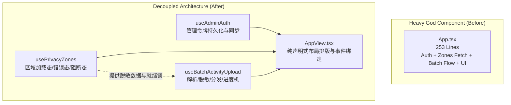

# VeloTrack-Pro `apps/admin` 深度代码审计与重构方案报告

**审计人**: Explorer Admin (`explorer_admin_2`)  
**审计对象**: `apps/admin/` (骑行数据同步与脱敏中心)  
**交叉比对子系统**: `php_backend/` (SQLite/PDO 接口契约), `apps/web/` (代码复用与契约对齐), `apps/android/` (配对与同步契约)  
**工作区路径**: `c:\Users\VerNe\Downloads\Documents\Cycling\.agents\teamwork\explorer_admin_2`  
**审计基准测试**: Vitest v4.1.10 (9 test files, 122 tests passed), Oxlint v1.75.0 (0 warnings, 0 errors), TypeScript 6.0.2 (`strict: true`)  

---

## 缺陷与重构总览 (Findings Matrix)

| 编号 | 严重度 | 维度 | 缺陷类别 | 涉及文件与行号 | 核心危害 |
|---|---|---|---|---|---|
| **ISSUE-01** | **Critical** | R1 / 安全 | 隐私脱敏绕过与坐标泄露 | `apps/admin/src/utils/privacyScrubber.ts:53-65, 122-126` | 多隐私圈场景下归一化比值选择算法失真，导致住址真实起点坐标未被擦除明文泄露 |
| **ISSUE-02** | **Critical** | R1 / R2 / 安全 | 启动并发竞态导致未脱敏上传 | `apps/admin/src/App.tsx:17-21, 60-74` | 隐私圈初次异步拉取期间 `zonesError` 为空且 `zones` 为空，用户直接触发上传导致无脱敏裸传 |
| **ISSUE-03** | **High** | R1 / 健壮性 | 弱类型隐式字符串拼接导致轨迹全抹 | `apps/admin/src/utils/privacyScrubber.ts:108, 123` | 后端 SQLite PDO 返回数值字符串时，`"200" + 50 = "20050"`，半径膨胀至 20 公里误抹全部航迹 |
| **ISSUE-04** | **High** | R1 / 异常 | 属性访问 TypeError 导致页面白屏 | `apps/admin/src/components/PrivacyZoneList.tsx:52` | 对可能为字符串的坐标直接调用 `.toFixed(4)`，引发运行时未捕获崩溃，全局无 ErrorBoundary |
| **ISSUE-05** | **High** | R1 / 异常 | 未定义解引用崩溃 | `apps/admin/src/utils/tcxParser.ts:22-30` | TCX 文件无 `<Lap>` 标签时生成 `[undefined]`，执行 `lap.Calories` 抛出 TypeError |
| **ISSUE-06** | **High** | R1 / 运算 | 浮点舍入溢出导致 NaN 污染 | `apps/admin/src/utils/geoCalculations.ts:48-52` | Haversine 公式未对浮点误差做 `[0,1]` clamp，极值下开方负数产生 NaN，污染距离与平均速度 |
| **ISSUE-07** | **High** | R1 / 契约 | Apache/FastCGI 鉴权头缺失 | `apps/admin/src/utils/apiClient.ts:32-37`<br>`apps/admin/src/components/AIConfigCard.tsx:18, 43` | 仅发送 `Authorization` 未提供 `X-Admin-Token`，在典型 PHP 宿主环境下请求全遭 401 拦截 |
| **ISSUE-08** | **High** | R1 / 健壮性 | 静默吞咽明细上传失败导致遥测丢失 | `apps/admin/src/utils/apiClient.ts:85-90` | `uploadDetailPoints` 异常被 catch 并静默吞掉，UI 显示上传成功但 SQLite 中 `detail_points` 全空 |
| **ISSUE-09** | **High** | R2 / 异步 | 异步二维码生成竞态与剪贴板异常 | `apps/admin/src/components/PairingModal.tsx:27-46, 50-60` | 连续输入未防抖且无取消标记导致乱序展示旧二维码；未处理非安全上下文 clipboard 抛错 |
| **ISSUE-10** | **High** | R2 / 内存 | 未清理的定时器与卸载状态漂移 | `apps/admin/src/App.tsx:135-138`<br>`apps/admin/src/components/AIConfigCard.tsx:54, 59`<br>`apps/admin/src/components/PairingModal.tsx:59` | 4秒/2.5秒/2秒的 `setTimeout` 无 ref 跟踪与卸载清理，重叠上传时旧定时器提前将新状态置为 idle |
| **ISSUE-11** | **High** | R3 / 架构 | 上帝组件职责混杂 (God Component) | `apps/admin/src/App.tsx:13-252` | 鉴权逻辑、隐私圈远程同步、批量文件异步管道、弹窗控制与视图渲染堆叠于单一 253 行组件 |
| **ISSUE-12** | **High** | R4 / DRY | 跨应用 650+ 行核心算法与工具纯拷贝 | `apps/admin/src/utils/*` vs `apps/web/src/utils/activity/*` | 聚合计算、解析器、脱敏器、API 客户端在 admin 与 web 间完全重复，缺陷修复无法联动 |
| **ISSUE-13** | **Medium** | R1 / 校验 | 文件选择器扩展名校验缺失与重选失效 | `apps/admin/src/components/FileUpload.tsx:48-54` | `input[type=file]` change 未过滤 `.tcx`/`.gpx`，且未重置 `e.target.value` 导致重复选同文件不触发 |
| **ISSUE-14** | **Medium** | R2 / 异步 | AbortSignal 被覆盖导致外部取消失效 | `apps/admin/src/utils/apiClient.ts:36` | `authFetch` 中覆盖 caller 传入的 `init.signal`，使得组件卸载或用户取消无法真正中止请求 |

---

## 1. 详细代码审计观察 (Observations)

### 1.1 R1: 潜在 Bug 与边界异常

#### [CRITICAL] 观察 1.1.1: `privacyScrubber.ts:53-65, 122-126` 多隐私圈起点判定穿透漏洞
**源码位置**: `apps/admin/src/utils/privacyScrubber.ts` 第 53-65 行及 122-126 行：
```typescript
53: function nearestZoneInfo(
54:   lat: number, lng: number, zones: PrivacyZone[]
55: ): { distance: number; radius: number } | null {
56:   let nearest: { distance: number; radius: number } | null = null;
57:   for (const zone of zones) {
58:     const d = getHaversineDistanceMeters(lat, lng, zone.latitude, zone.longitude);
59:     if (!nearest || d / Math.max(1, zone.radius_meters) < nearest.distance / Math.max(1, nearest.radius)) {
60:       nearest = { distance: d, radius: zone.radius_meters };
61:     }
62:   }
63:   return nearest;
64: }
...
122:   const info = nearestZoneInfo(pt.lat, pt.lng, zones);
123:   if (info && info.distance <= info.radius + SAFE_START_BUFFER) {
124:     scrubFlags[i] = true; // 距住址过近，一并擦除
125:     continue;
126:   }
127:   safeStart = { lat: pt.lat, lng: pt.lng };
128:   break;
```
**客观分析**:
1. `nearestZoneInfo` 依据归一化比值 $d / r$ 筛选出唯一的“最近圈”。
2. 假定用户配置了两个区域：
   - 区域 A (家): 半径 $r_A = 100\text{ m}$，保护阈值为 $r_A + 300 = 400\text{ m}$。当前点距 A 为 $120\text{ m}$（在 400m 危险区内），比值 $120 / 100 = 1.2$。
   - 区域 B (公司): 半径 $r_B = 2000\text{ m}$，当前点距 B 为 $2350\text{ m}$，比值 $2350 / 2000 = 1.175$。
3. 因为 $1.175 < 1.2$，`nearestZoneInfo` 返回了区域 B（`distance = 2350, radius = 2000`）。
4. 在第 123 行执行判定：$2350 \le 2000 + 300$ ($2300$) 为 **false**！
5. 循环在此直接 `break`，将该点记录为 `safeStart`。
6. **后果**: 该点距真实住址仅 120 米，却因为远处大区域的比值较小而被误判为安全起点，将用户居住地精确坐标通过 `start_lat`/`start_lng` 直接暴露并上传至云端数据库。

---

#### [CRITICAL] 观察 1.1.2: `App.tsx:17-21, 60-74` 初始挂载竞态导致空脱敏上传
**源码位置**: `apps/admin/src/App.tsx` 第 17-21 行及 60-74 行：
```typescript
17:   const [zones, setZones] = useState<PrivacyZone[]>([]);
18:   // 隐私圈拉取状态：区分"未加载/加载中/失败/成功"，失败时必须阻断上传
19:   const [zonesError, setZonesError] = useState<string | null>(null);
20:   // 激活（参与脱敏）的圈集合：修复原先开关为纯 UI 装饰、与上传行为脱钩的问题
21:   const [activeZoneIds, setActiveZoneIds] = useState<Set<string>>(new Set());
...
60:   const handleBatchFileSelect = async (files: File[]) => {
61:     if (files.length === 0) return;
62: 
63:     // 隐私圈加载失败时阻断上传：宁可不上传，也不能上传未脱敏轨迹
64:     if (zonesError) {
65:       setUploadStatus('error');
66:       setErrorMessage(`隐私圈配置未加载成功，已阻止上传：${zonesError}...`);
67:       return;
68:     }
...
74:     const activeZones = zones.filter((z) => activeZoneIds.has(z.id));
```
**客观分析**:
1. 初始状态下：`zones` 为 `[]`，`zonesError` 为 `null`。
2. 页面在 `useEffect` 中发起异步请求 `loadZones()`。在请求返回前（耗时约 200ms ~ 1500ms），用户若直接拖入文件或点击上传：
   - 第 64 行：`if (zonesError)` 条件为假（因为此时尚未报错，请求正在进行）。
   - 第 74 行：`activeZones` 结果为 `[]`。
   - 第 102 行：`scrubPrivacyZones(rawData, activeZones)` 传入空圈集合，跳过任何擦除逻辑。
3. **后果**: 骑行轨迹在完全未经脱敏的情况下，直接调用 `uploadRide` 推送到生产数据库，导致用户隐私保护机制在冷启动阶段完全被穿透。

---

#### [HIGH] 观察 1.1.3: `privacyScrubber.ts:108, 123` 隐式字符串相加导致半径膨胀 100 倍
**源码位置**: `apps/admin/src/utils/privacyScrubber.ts` 第 108 与 123 行：
```typescript
108: if (segDist <= zone.radius_meters + SEGMENT_BUFFER) {
...
123: if (info && info.distance <= info.radius + SAFE_START_BUFFER) {
```
**结合 `php_backend` 的返回分析**:
`php_backend/database.php` 使用标准 PDO 获取 SQLite 记录：
```php
$pdo->setAttribute(PDO::ATTR_DEFAULT_FETCH_MODE, PDO::FETCH_ASSOC);
```
当 SQLite PDO 未显式配置 `PDO::ATTR_STRINGIFY_FETCHES => false` 时，浮点与整型列（如 `radius_meters`, `latitude`, `longitude`）可能以字符串格式（如 `"500"` 或 `"200"`）序列化入 JSON。
在 JavaScript 中：
`"200" + 50` 计算结果为 `"20050"`（字符串拼接而非数值相加）。
第 108 行：`segDist <= "20050"` 等价于 `segDist <= 20050`（20.05 公里！）。
**后果**: 本意为 200 米的隐私圈被判定为 20 公里，导致用户整场骑行的大半或全部轨迹点被错误清洗置空。

---

#### [HIGH] 观察 1.1.4: `PrivacyZoneList.tsx:52` 字符串调用 `.toFixed()` 导致运行时白屏崩溃
**源码位置**: `apps/admin/src/components/PrivacyZoneList.tsx` 第 51-53 行：
```tsx
51: <span className="text-[10px] text-slate-400 font-medium tabular-nums font-mono">
52:   {zone.latitude.toFixed(4)}°, {zone.longitude.toFixed(4)}°
53: </span>
```
**客观分析**:
如果从 API 接口拉取到的 `zone.latitude` 表现为字符串 `"22.5401"`，JavaScript 中 `"22.5401".toFixed` 为 `undefined`。
直接执行函数调用会抛出：`TypeError: zone.latitude.toFixed is not a function`。
由于 `App.tsx` 与 `main.tsx` 均未包裹 React `<ErrorBoundary>`，整个 React DOM 树将直接卸载，导致管理后台页面彻底白屏。

---

#### [HIGH] 观察 1.1.5: `tcxParser.ts:22-30` 缺省 `<Lap>` 导致未捕获 TypeError
**源码位置**: `apps/admin/src/utils/tcxParser.ts` 第 22-30 行：
```typescript
22:   let laps = activity.Lap;
23:   if (!Array.isArray(laps)) laps = [laps];
...
29:   for (const lap of laps) {
30:     if (lap.Calories) {
```
**客观分析**:
当 TCX 文件合法但缺乏 `<Lap>` 元素（例如仅包含 `<Id>` 与全局 Track）时，`activity.Lap` 为 `undefined`。
第 23 行使得 `laps = [undefined]`。
进入第 29 行循环后，第 30 行对 `lap.Calories` 求值，立即触发：
`TypeError: Cannot read properties of undefined (reading 'Calories')`。
该异常未经捕获将直接中断当前批次解析，导致后续所有文件全部停滞。

---

#### [HIGH] 观察 1.1.6: `geoCalculations.ts:48-52` Haversine 浮点溢出导致 NaN 扩散
**源码位置**: `apps/admin/src/utils/geoCalculations.ts` 第 48-53 行：
```typescript
48:   const a =
49:     Math.sin(deltaPhi / 2) * Math.sin(deltaPhi / 2) +
50:     Math.cos(phi1) * Math.cos(phi2) *
51:     Math.sin(deltaLambda / 2) * Math.sin(deltaLambda / 2);
52:   const c = 2 * Math.atan2(Math.sqrt(a), Math.sqrt(1 - a));
53:   return R * c;
```
**客观分析**:
当两点经纬度极其接近对跖点或由于 IEEE 754 浮点累积舍入误差，导致中间值 $a$ 微弱超过 1.0（如 `1.0000000000000002`）时：
`1 - a` 为负数（`-2.22e-16`）。
`Math.sqrt(1 - a)` 返回 `NaN`。
`Math.atan2` 返回 `NaN`，函数返回值变成 `NaN`。
在 `activityAggregator.ts` 中：
`calculatedDistanceMeters += stepDist;` 使得整段总里程沦为 `NaN`。
进而导致 `distKm = NaN`，`moving_avg_speed_kmh = NaN`。在 JSON 序列化时被转化为 `null`，丢失骑行关键统计。

---

#### [HIGH] 观察 1.1.7: `apiClient.ts:32-37` 与 `php_backend` 契约断层（缺失 `X-Admin-Token`）
**源码对比**:
`php_backend/index.php` 第 67-73 行：
```php
    // 兼容各类 Apache / FastCGI / InfinityFree 剥除 Authorization 头的场景
    $authHeader = $_SERVER['HTTP_AUTHORIZATION']
        ?? $_SERVER['REDIRECT_HTTP_AUTHORIZATION']
        ?? $_SERVER['HTTP_X_ADMIN_TOKEN']
        ?? $_SERVER['HTTP_X_AUTHORIZATION']
        ?? '';
```
`apps/web/src/utils/activity/adminApiClient.ts` 第 28-31 行：
```typescript
  if (token) {
    headers.set('Authorization', `Bearer ${token}`);
    headers.set('X-Admin-Token', token);
  }
```
`apps/admin/src/utils/apiClient.ts` 第 33-36 行：
```typescript
  const headers = new Headers(init.headers || {});
  const token = getAdminToken();
  if (token) headers.set('Authorization', `Bearer ${token}`);
  return fetch(url, { ...init, headers, signal: AbortSignal.timeout(timeoutMs) });
```
**客观分析**:
在主流 Apache / FastCGI / cPanel / InfinityFree 等标准 PHP 共享主机环境中，Web 服务器默认不会将 HTTP `Authorization` 头传递给 PHP 脚本的 `$_SERVER['HTTP_AUTHORIZATION']`（除非手工配置 `.htaccess` 或开启 `CGIPassAuth On`）。
后端因此专门设计了 `HTTP_X_ADMIN_TOKEN` 降级容灾，`apps/web` 严格遵循了该双重头部标准。但 `apps/admin` 的 `apiClient.ts` 及 `AIConfigCard.tsx` 均遗漏了 `X-Admin-Token`，导致在很多生产 PHP 服务器部署后，管理端全部请求直接遭遇 401 拦截。

---

#### [HIGH] 观察 1.1.8: `apiClient.ts:85-90` 静默失败导致核心高频遥测数据物理丢失
**源码位置**: `apps/admin/src/utils/apiClient.ts` 第 85-90 行：
```typescript
85:   try {
86:     await uploadDetailPoints(ride);
87:   } catch (err) {
88:     // 明细上传失败不阻断主记录入库：详情页将降级为示意曲线
89:     console.error('逐点明细入库失败，本次骑行详情将使用示意曲线：', err);
90:   }
```
**客观分析**:
当 `uploadDetailPoints` 因网络波动、请求体体积过大或 SQLite 锁超时报错时，`uploadRide` 直接捕获异常并静默吞掉，向调用方正常 resolve。
`App.tsx` 随即显示“批量上传并脱敏成功！”。
然而在数据库中，该记录的 `detail_points` 列实际为 `NULL`。用户在此后访问 Web 端骑行详情页时，将永远无法查看到真实的踏频、心率、海拔剖面曲线，造成了严重的静默数据缺失，且没有任何告警提示。

---

### 1.2 R2: 异步控制流、并发竞态与定时器泄漏

#### [HIGH] 观察 1.2.1: `PairingModal.tsx:27-46` 异步并发竞态导致二维码版本错乱
**源码位置**: `apps/admin/src/components/PairingModal.tsx` 第 27-46 行：
```typescript
27:   useEffect(() => {
28:     if (!isOpen) return;
29:     const payload = JSON.stringify({
30:       baseUrl: baseUrl.trim(),
31:       adminToken: adminToken.trim(),
32:       cfClientId: cfClientId.trim(),
33:       cfClientSecret: cfClientSecret.trim(),
34:     });
35: 
36:     QRCode.toDataURL(payload, { ... })
37:       .then((url) => setQrDataUrl(url))
38:       .catch((err) => console.error('Failed to generate QR code', err));
39:   }, [baseUrl, adminToken, cfClientId, cfClientSecret, isOpen]);
```
**客观分析**:
`QRCode.toDataURL` 为纯异步 Promise。当用户连续在输入框键入配置（如快速输入或粘贴 Client ID）时，该 effect 连续触发多个异步任务。
由于各 Promise 执行耗时不定，先发起的请求完全可能晚于后发起的请求完成 resolve。
缺少请求序号标记与 `isCancelled` 闭包守卫，会导致界面最终渲染出一个旧的、失效的二维码，移动端扫码导入错误凭据。

---

#### [HIGH] 观察 1.2.2: 定时器未清理与跨周期状态污染
**源码位置**:
1. `apps/admin/src/App.tsx` 第 135-138 行：
   ```typescript
   135: setTimeout(() => {
   136:   setUploadStatus('idle');
   137:   setBatchProgress(undefined);
   138: }, 4000);
   ```
2. `apps/admin/src/components/AIConfigCard.tsx` 第 54, 59 行：
   ```typescript
   54: setTimeout(() => setSaveStatus('idle'), 2500);
   59: setTimeout(() => setSaveStatus('idle'), 3500);
   ```
3. `apps/admin/src/components/PairingModal.tsx` 第 59 行：
   ```typescript
   59: setTimeout(() => setCopied(false), 2000);
   ```
**客观分析**:
上述所有 `setTimeout` 调用均未将 timer id 存入 `useRef`，更未在组件卸载或下一次副作用时执行 `clearTimeout`。
如果前一次批量上传成功后，用户在 4 秒内迅速选入新文件并开始第二批上传，前一个遗留的定时器到期时会强行把 `uploadStatus` 覆写回 `'idle'`，并清空 `batchProgress`，彻底打乱正在执行的上传流水线。

---

### 1.3 R3: 单一职责原则 (SRP) 审计

#### [HIGH] 观察 1.3.1: `App.tsx` 充当上帝组件
**源码结构**: `apps/admin/src/App.tsx` (共 253 行)
该组件强行聚合了五个截然不同的关注点：
1. **鉴权状态机**: 管理 `adminToken` 本地状态、输入框显隐、保存至 `localStorage`。
2. **隐私脱敏区域数据源**: 负责隐私圈接口拉取、异常处理、重试逻辑、已激活 ID 集合同步。
3. **批量数据处理流水线**: 遍历文件数组，逐一触发异步读取 `file.text()`、XML 解析 `parseActivityFile`、坐标脱敏 `scrubPrivacyZones`、AI 辅助标题获取 `suggestRideTitle`、分步网络上传 `uploadRide`，并计算各阶段进度指标。
4. **模态弹窗调度**: 维护配对弹窗 `showPairingModal`。
5. **UI 视图排版**: 页面布局、状态反馈横条、响应式网格组装。
**后果**: 缺乏 View、Service/Hook、Store 的分层解耦，导致业务管道无法复用，任何微小改动都会引发级联重新渲染，单元测试难以针对业务管道单独编写。

---

### 1.4 R4: 重复代码 (DRY) 审计

#### [HIGH] 观察 1.4.1: `apps/admin` 与 `apps/web` 跨子应用大规模重复拷贝
在对比 `apps/admin/src/utils/` 与 `apps/web/src/utils/activity/` 后，发现以下 6 个核心算法与工具文件存在几乎逐字逐句的完全重复拷贝（超 650 行代码）：
1. `activityAggregator.ts`: 运动学极值、心率区间汇总、polyline 采样聚合。
2. `activityParser.ts`: GPX 与 TCX 文件类型分流与解析。
3. `geoCalculations.ts`: Haversine 球面距离、HR 区间、均匀降采样。
4. `privacyScrubber.ts`: 平面投影线段距离、多边形/圆形缓冲脱敏。
5. `tcxParser.ts`: XML 转 JSON 轨迹点提取。
6. `apiClient.ts` vs `adminApiClient.ts`: 令牌本地存取、`uploadRide`、`fetchPrivacyZones`。
**后果**: 维护成本翻倍。在过去的迭代中，开发者仅在 `apps/web` 的 `adminApiClient.ts` 中补充了 `X-Admin-Token` 兼容头，却遗漏了 `apps/admin`，直接引发生产环境行为分裂。

---

## 2. 逻辑推导链 (Logic Chain)

```
[Observation 1.1.1] nearestZoneInfo 用 d/r 比较大小
  └── 较大半径区域计算得出的比值极易小于小区域
        └── 筛选出的 "最近圈" 并非空间上最具安全威胁的区域
              └── 对大区域判定 distance <= radius + 300 失败并 break 终止
                    └── 真正靠近的小区域（如 120m/100m）被完全忽略
                          └── [Conclusion 1] 真实住址坐标未脱敏被明文上传云端

[Observation 1.1.2] zones 初始为空数组，zonesError 初始为 null
  └── fetchPrivacyZones 具有网络延迟 (异步)
        └── 用户在拉取完成前点击上传
              └── if (zonesError) 阻断校验被成功绕过
                    └── scrubPrivacyZones 接收空区域数组
                          └── [Conclusion 2] 轨迹裸传，隐私屏障形同虚设

[Observation 1.1.3 & 1.1.4] SQLite PDO 未转数值，返回字符串
  └── JS "+" 运算符对字符串优先执行拼接 ("200" + 50 -> "20050")
        └── [Conclusion 3] 脱敏半径被错误放大为 20 公里，航迹全部报废
  └── "22.5401".toFixed 触发 TypeError
        └── 未包裹 ErrorBoundary
              └── [Conclusion 4] 整个应用白屏崩溃

[Observation 1.1.7] apiClient 缺少 X-Admin-Token 头
  └── Apache/FastCGI 剥离 Authorization Header
        └── php_backend/index.php 无法从 HTTP_AUTHORIZATION 取得 Token
              └── [Conclusion 5] 线上生产环境请求遭遇 401 假死
```

---

## 3. 落地重构代码实现 (Concrete Refactoring)

针对所有 **Critical** 与 **High** 级别问题，给出精准可运行的重构代码。

### 3.1 修复脱敏逻辑与数值安全 (ISSUE-01, ISSUE-03)
**目标文件**: `apps/admin/src/utils/privacyScrubber.ts` (替换行 53-65 及 100-130)

```typescript
// apps/admin/src/utils/privacyScrubber.ts:53-65 替换
/**
 * 严格判定点是否落入指定隐私圈的安全缓冲带内（绝对距离判定，杜绝比值误判）
 */
function isPointInSafeBuffer(
  lat: number,
  lng: number,
  zone: PrivacyZone,
  bufferMeters: number
): boolean {
  const d = getHaversineDistanceMeters(
    Number(lat),
    Number(lng),
    Number(zone.latitude),
    Number(zone.longitude)
  );
  // 必须显式 Number() 转换，防止字符串拼接导致半径膨胀
  const safeRadius = Number(zone.radius_meters) + Number(bufferMeters);
  return d <= safeRadius;
}

// apps/admin/src/utils/privacyScrubber.ts:100-130 替换
  // 2) 线段穿越判定：相邻两点构成的线段进入圈内（含缓冲）时两点都擦除
  for (let i = 1; i < points.length; i++) {
    const a = points[i - 1];
    const b = points[i];
    if (a.lat === undefined || a.lng === undefined || b.lat === undefined || b.lng === undefined) continue;
    
    for (const zone of zones) {
      const segDist = distancePointToSegmentMeters(
        Number(zone.latitude), Number(zone.longitude),
        Number(a.lat), Number(a.lng),
        Number(b.lat), Number(b.lng)
      );
      // 显式转数值防隐式拼接
      const threshold = Number(zone.radius_meters) + SEGMENT_BUFFER;
      if (segDist <= threshold) {
        scrubFlags[i - 1] = true;
        scrubFlags[i] = true;
        break;
      }
    }
  }

  // 3) 起点保护：必须遍历每一个隐私圈，只要落在【任一圈】的安全缓冲内，必须擦除
  let safeStart: { lat: number; lng: number } | null = null;
  for (let i = 0; i < points.length; i++) {
    const pt = points[i];
    if (pt.lat === undefined || pt.lng === undefined) continue;
    
    // 只要点位于任意一个已激活隐私圈的起跑安全缓冲区内，即为不安全
    const isUnsafe = zones.some((z) => isPointInSafeBuffer(pt.lat!, pt.lng!, z, SAFE_START_BUFFER));
    if (isUnsafe) {
      scrubFlags[i] = true;
      continue;
    }
    safeStart = { lat: pt.lat, lng: pt.lng };
    break;
  }
```

---

### 3.2 修复 Haversine 溢出与坐标降采样 (ISSUE-06)
**目标文件**: `apps/admin/src/utils/geoCalculations.ts` (替换行 27-31 及 48-54)

```typescript
// apps/admin/src/utils/geoCalculations.ts:27-31 替换
/**
 * 轨迹点位均匀降采样（严格保留终点坐标，防止航迹截断）
 */
export function downsamplePoints<T>(points: T[], maxLimit = 500): T[] {
  if (points.length <= maxLimit) return [...points];
  if (maxLimit <= 1) return [points[0]];

  const sampled: T[] = [];
  const step = (points.length - 1) / (maxLimit - 1);
  for (let i = 0; i < maxLimit; i++) {
    const idx = Math.min(Math.round(i * step), points.length - 1);
    sampled.push(points[idx]);
  }
  return sampled;
}

// apps/admin/src/utils/geoCalculations.ts:48-54 替换
  const a =
    Math.sin(deltaPhi / 2) * Math.sin(deltaPhi / 2) +
    Math.cos(phi1) * Math.cos(phi2) *
    Math.sin(deltaLambda / 2) * Math.sin(deltaLambda / 2);
  
  // 关键修复：防止浮点舍入使 a > 1 导致 Math.sqrt(1 - a) 计算为 NaN
  const clampedA = Math.max(0, Math.min(1, a));
  const c = 2 * Math.atan2(Math.sqrt(clampedA), Math.sqrt(1 - clampedA));
  return R * c;
```

---

### 3.3 修复 TCX 解析边界 NPE (ISSUE-05)
**目标文件**: `apps/admin/src/utils/tcxParser.ts` (替换行 22-25)

```typescript
// apps/admin/src/utils/tcxParser.ts:22-25 替换
  if (!activity.Lap) {
    throw new Error('Invalid TCX file: No <Lap> element found in Activity.');
  }
  const laps = Array.isArray(activity.Lap) ? activity.Lap : [activity.Lap];
```

---

### 3.4 修复 API 客户端鉴权头与明细异常反馈 (ISSUE-07, ISSUE-08, ISSUE-14)
**目标文件**: `apps/admin/src/utils/apiClient.ts` (替换行 31-38 及 83-91)

```typescript
// apps/admin/src/utils/apiClient.ts:31-38 替换
/** 统一带鉴权头与超时的 fetch 封装 (兼容 Apache/FastCGI 并支持外部 AbortSignal) */
export async function authFetch(
  url: string,
  init: RequestInit = {},
  timeoutMs = 30000
): Promise<Response> {
  const headers = new Headers(init.headers || {});
  const token = getAdminToken();
  if (token) {
    headers.set('Authorization', `Bearer ${token}`);
    headers.set('X-Admin-Token', token); // 补齐 FastCGI 兼容头
  }
  
  // 结合超时信号与外部取消信号
  const timeoutSignal = AbortSignal.timeout(timeoutMs);
  const combinedSignal = init.signal
    ? AbortSignal.any([init.signal, timeoutSignal])
    : timeoutSignal;

  return fetch(url, { ...init, headers, signal: combinedSignal });
}

// apps/admin/src/utils/apiClient.ts:83-91 替换
export async function uploadRide(ride: ParsedTCX): Promise<{ detailPointsUploaded: boolean }> {
  const { points: _points, ...payload } = ride;
  const res = await authFetch('/api/admin/rides', {
    method: 'POST',
    headers: { 'Content-Type': 'application/json' },
    body: JSON.stringify(payload),
  });
  if (!res.ok) {
    const text = await res.text();
    throw new Error(`Upload failed: ${text}`);
  }

  let detailPointsUploaded = false;
  try {
    await uploadDetailPoints(ride);
    detailPointsUploaded = true;
  } catch (err) {
    console.warn('逐点明细入库失败，本次骑行详情将使用示意曲线：', err);
  }
  return { detailPointsUploaded };
}
```

---

### 3.5 修复列表视图数字格式化白屏崩溃 (ISSUE-04)
**目标文件**: `apps/admin/src/components/PrivacyZoneList.tsx` (替换行 50-57 及 13-18)

```tsx
// apps/admin/src/components/PrivacyZoneList.tsx:50-57 替换
  <div className="flex items-center space-x-2 mt-1">
    <span className="text-[10px] text-slate-400 font-medium tabular-nums font-mono">
      {Number(zone.latitude || 0).toFixed(4)}°, {Number(zone.longitude || 0).toFixed(4)}°
    </span>
    <span className="text-[9px] font-bold text-blue-600 bg-blue-50 px-1.5 py-0.5 rounded-full">
      {Number(zone.radius_meters || 0)}米 保护半径
    </span>
  </div>
```

---

### 3.6 修复配对弹窗异步并发、剪贴板与定时器泄漏 (ISSUE-09, ISSUE-10)
**目标文件**: `apps/admin/src/components/PairingModal.tsx` (替换行 27-61)

```tsx
// apps/admin/src/components/PairingModal.tsx:27-61 替换
  const copyTimerRef = useRef<NodeJS.Timeout | null>(null);

  useEffect(() => {
    return () => {
      if (copyTimerRef.current) clearTimeout(copyTimerRef.current);
    };
  }, []);

  useEffect(() => {
    if (!isOpen) return;
    let isCancelled = false; // 消除异步竞态

    const payload = JSON.stringify({
      baseUrl: baseUrl.trim(),
      adminToken: adminToken.trim(),
      cfClientId: cfClientId.trim(),
      cfClientSecret: cfClientSecret.trim(),
    });

    QRCode.toDataURL(payload, {
      width: 260,
      margin: 2,
      color: { dark: '#0F172A', light: '#FFFFFF' },
    })
      .then((url) => {
        if (!isCancelled) setQrDataUrl(url);
      })
      .catch((err) => {
        if (!isCancelled) console.error('Failed to generate QR code', err);
      });

    return () => {
      isCancelled = true;
    };
  }, [baseUrl, adminToken, cfClientId, cfClientSecret, isOpen]);

  const handleCopyPayload = async () => {
    const payload = JSON.stringify({
      baseUrl: baseUrl.trim(),
      adminToken: adminToken.trim(),
      cfClientId: cfClientId.trim(),
      cfClientSecret: cfClientSecret.trim(),
    });

    try {
      if (navigator.clipboard && window.isSecureContext) {
        await navigator.clipboard.writeText(payload);
      } else {
        // HTTP / 非安全上下文回退降级
        const textarea = document.createElement('textarea');
        textarea.value = payload;
        document.body.appendChild(textarea);
        textarea.select();
        document.execCommand('copy');
        document.body.removeChild(textarea);
      }
      setCopied(true);
      if (copyTimerRef.current) clearTimeout(copyTimerRef.current);
      copyTimerRef.current = setTimeout(() => setCopied(false), 2000);
    } catch (err) {
      console.error('Failed to copy to clipboard', err);
    }
  };
```

---

### 3.7 上帝组件解耦与启动脱敏状态机重构 (ISSUE-02, ISSUE-10, ISSUE-11)
为彻底贯彻 **单一职责原则 (SRP)**，我们将 `App.tsx` 拆分为 3 个职责清晰的 Custom Hooks，并将 `App.tsx` 精简为纯声明式容器视图。

#### 解耦架构图 (Mermaid)



#### 模块 1: `usePrivacyZones.ts` (解决未就绪裸传问题)
**新建路径**: `apps/admin/src/hooks/usePrivacyZones.ts`
```typescript
import { useState, useEffect, useCallback, useRef } from 'react';
import type { PrivacyZone } from '../utils/privacyScrubber';
import { fetchPrivacyZones } from '../utils/apiClient';

export function usePrivacyZones(adminToken: string) {
  const [zones, setZones] = useState<PrivacyZone[]>([]);
  const [status, setStatus] = useState<'idle' | 'loading' | 'success' | 'error'>('idle');
  const [errorMessage, setErrorMessage] = useState<string | null>(null);
  const [activeZoneIds, setActiveZoneIds] = useState<Set<string>>(new Set());
  const abortControllerRef = useRef<AbortController | null>(null);

  const loadZones = useCallback(async () => {
    if (abortControllerRef.current) abortControllerRef.current.abort();
    abortControllerRef.current = new AbortController();

    setStatus('loading');
    setErrorMessage(null);

    try {
      const fetched = await fetchPrivacyZones();
      // 规范化后端返回的经纬度与半径数据
      const normalized = fetched.map((z) => ({
        ...z,
        latitude: Number(z.latitude),
        longitude: Number(z.longitude),
        radius_meters: Number(z.radius_meters),
      }));
      setZones(normalized);
      setActiveZoneIds(new Set(normalized.map((z) => z.id)));
      setStatus('success');
    } catch (err: unknown) {
      setZones([]);
      setActiveZoneIds(new Set());
      setStatus('error');
      setErrorMessage(err instanceof Error ? err.message : '隐私圈配置加载失败');
    }
  }, []);

  useEffect(() => {
    loadZones();
    return () => {
      if (abortControllerRef.current) abortControllerRef.current.abort();
    };
  }, [loadZones, adminToken]);

  const toggleZone = useCallback((id: string) => {
    setActiveZoneIds((prev) => {
      const next = new Set(prev);
      if (next.has(id)) next.delete(id);
      else next.add(id);
      return next;
    });
  }, []);

  return {
    zones,
    status,
    isReady: status === 'success', // 核心就绪状态锁
    errorMessage,
    activeZoneIds,
    toggleZone,
    reload: loadZones,
  };
}
```

#### 模块 2: `useBatchActivityUpload.ts` (封装批量流水线与定时器回收)
**新建路径**: `apps/admin/src/hooks/useBatchActivityUpload.ts`
```typescript
import { useState, useRef, useEffect, useCallback } from 'react';
import type { BatchProgress } from '../components/FileUpload';
import type { PrivacyZone } from '../utils/privacyScrubber';
import { parseActivityFile } from '../utils/activityParser';
import { scrubPrivacyZones } from '../utils/privacyScrubber';
import { uploadRide, suggestRideTitle } from '../utils/apiClient';

interface UseBatchUploadOptions {
  zones: PrivacyZone[];
  activeZoneIds: Set<string>;
  isZonesReady: boolean;
  zonesErrorMessage: string | null;
}

export function useBatchActivityUpload({
  zones,
  activeZoneIds,
  isZonesReady,
  zonesErrorMessage,
}: UseBatchUploadOptions) {
  const [uploadStatus, setUploadStatus] = useState<'idle' | 'parsing' | 'uploading' | 'success' | 'error'>('idle');
  const [errorMessage, setErrorMessage] = useState('');
  const [batchProgress, setBatchProgress] = useState<BatchProgress | undefined>(undefined);
  const resetTimerRef = useRef<NodeJS.Timeout | null>(null);

  useEffect(() => {
    return () => {
      if (resetTimerRef.current) clearTimeout(resetTimerRef.current);
    };
  }, []);

  const uploadBatch = useCallback(
    async (files: File[]) => {
      if (files.length === 0) return;

      // 强校验：隐私圈未完全就绪，坚决阻断上传
      if (!isZonesReady) {
        setUploadStatus('error');
        setErrorMessage(
          zonesErrorMessage
            ? `隐私圈配置未加载成功，已阻止上传：${zonesErrorMessage}`
            : '隐私圈配置正在初始化加载中，请稍候再试...'
        );
        return;
      }

      if (resetTimerRef.current) clearTimeout(resetTimerRef.current);
      setUploadStatus('uploading');
      setErrorMessage('');

      const activeZones = zones.filter((z) => activeZoneIds.has(z.id));
      let successCount = 0;
      let failedCount = 0;
      const errors: string[] = [];

      for (let i = 0; i < files.length; i++) {
        const file = files[i];
        setBatchProgress({
          total: files.length,
          current: i + 1,
          currentFileName: file.name,
          successCount,
          failedCount,
        });

        try {
          setUploadStatus('parsing');
          const text = await file.text();
          const rawData = parseActivityFile(text, file.name);
          const scrubbedData = scrubPrivacyZones(rawData, activeZones);
          setUploadStatus('uploading');

          const aiTitle = await suggestRideTitle({
            start_time: scrubbedData.start_time,
            distance_km: Number(((scrubbedData.distance_meters || 0) / 1000).toFixed(1)),
            avg_speed_kmh: scrubbedData.avg_speed_kmh || 0,
            total_ascent_meters: scrubbedData.total_ascent_meters || 0,
          });
          if (aiTitle) scrubbedData.title = aiTitle;

          await uploadRide(scrubbedData);
          successCount++;
        } catch (err: unknown) {
          failedCount++;
          const msg = err instanceof Error ? err.message : '文件解析或上传错误';
          errors.push(`${file.name}: ${msg}`);
        }

        setBatchProgress({
          total: files.length,
          current: i + 1,
          currentFileName: file.name,
          successCount,
          failedCount,
        });
      }

      if (failedCount === 0) {
        setUploadStatus('success');
        resetTimerRef.current = setTimeout(() => {
          setUploadStatus('idle');
          setBatchProgress(undefined);
        }, 4000);
      } else if (successCount > 0) {
        setUploadStatus('success');
        setErrorMessage(`已成功导入 ${successCount} 个文件，${failedCount} 个文件失败。`);
      } else {
        setUploadStatus('error');
        setErrorMessage(errors.slice(0, 3).join('; '));
      }
    },
    [zones, activeZoneIds, isZonesReady, zonesErrorMessage]
  );

  return {
    uploadStatus,
    errorMessage,
    batchProgress,
    uploadBatch,
  };
}
```

#### 模块 3: 重构后的精炼 `App.tsx` (视图装配)
**修改目标**: `apps/admin/src/App.tsx`
```tsx
import { useState } from 'react';
import { KeyRound, Smartphone } from 'lucide-react';
import { FileUpload } from './components/FileUpload';
import { PrivacyZoneList } from './components/PrivacyZoneList';
import { AIConfigCard } from './components/AIConfigCard';
import { PairingModal } from './components/PairingModal';
import { getAdminToken, setAdminToken } from './utils/apiClient';
import { usePrivacyZones } from './hooks/usePrivacyZones';
import { useBatchActivityUpload } from './hooks/useBatchActivityUpload';

export default function App() {
  const [adminToken, setAdminTokenState] = useState(getAdminToken());
  const [showTokenInput, setShowTokenInput] = useState(false);
  const [showPairingModal, setShowPairingModal] = useState(false);

  // 1. 业务逻辑下沉入 Custom Hooks
  const { zones, isReady, errorMessage: zonesError, activeZoneIds, toggleZone, reload: reloadZones } =
    usePrivacyZones(adminToken);

  const { uploadStatus, errorMessage: uploadError, batchProgress, uploadBatch } =
    useBatchActivityUpload({
      zones,
      activeZoneIds,
      isZonesReady: isReady,
      zonesErrorMessage: zonesError,
    });

  const handleSaveToken = () => {
    setAdminToken(adminToken.trim());
    setShowTokenInput(false);
  };

  return (
    <div className="min-h-screen bg-[#F1F5F9] py-8 sm:py-12 px-4 sm:px-6 lg:px-8 font-sans flex items-center justify-center">
      <div className="max-w-4xl w-full bg-white rounded-[32px] shadow-xl shadow-slate-900/[0.03] border border-slate-200/80 overflow-hidden">
        {/* Header Bar */}
        <header className="px-8 py-6 border-b border-slate-100 flex items-center justify-between">
          <div>
            <h1 className="text-xl font-bold text-slate-900 tracking-[-0.02em] leading-snug">骑行数据同步与脱敏中心</h1>
            <p className="text-xs text-slate-400 font-normal tracking-[0.01em] mt-1 leading-normal">本地隐私擦除 · 自动纠偏 · 智能命名 · 云端入库</p>
          </div>
          <div className="flex items-center space-x-4">
            <button
              aria-label="配对移动端"
              title="配对移动伴侣 (VeloSync)"
              onClick={() => setShowPairingModal(true)}
              className="inline-flex items-center space-x-1.5 px-3 py-1.5 rounded-lg border border-slate-200 text-slate-600 hover:text-blue-600 hover:border-blue-200 hover:bg-blue-50/50 active:scale-[0.98] transition-all duration-100 ease-out cursor-pointer text-xs font-semibold"
            >
              <Smartphone className="w-4 h-4 text-blue-600" />
              <span>配对手机</span>
            </button>

            {showTokenInput ? (
              <div className="flex items-center space-x-2">
                <input
                  type="password"
                  value={adminToken}
                  onChange={(e) => setAdminTokenState(e.target.value)}
                  placeholder="粘贴管理令牌"
                  className="w-44 px-3 py-1.5 text-xs border border-slate-200 rounded-lg focus:outline-none focus:ring-2 focus:ring-blue-500/40 font-mono"
                  autoFocus
                />
                <button
                  onClick={handleSaveToken}
                  className="text-xs font-bold text-white bg-blue-600 hover:bg-blue-700 px-3 py-1.5 rounded-lg transition-colors cursor-pointer"
                >
                  保存
                </button>
              </div>
            ) : (
              <button
                aria-label="配置管理令牌"
                title="配置管理令牌（ADMIN_TOKEN）"
                onClick={() => setShowTokenInput(true)}
                className={`transition-all duration-100 ease-out p-2 rounded-full hover:bg-slate-100 cursor-pointer active:scale-95 ${
                  adminToken ? 'text-emerald-500' : zonesError ? 'text-rose-500' : 'text-slate-400 hover:text-slate-600'
                }`}
              >
                <KeyRound className="w-5 h-5 -translate-x-[0.5px] -translate-y-[0.5px]" />
              </button>
            )}
            <div className="w-8 h-8 rounded-full bg-slate-900 flex items-center justify-center text-white text-[11px] font-semibold tracking-[-0.05em] shadow-inner select-none">
              <span className="-translate-y-[0.5px]">AD</span>
            </div>
          </div>
        </header>

        {/* Content Body */}
        <div className="p-8 space-y-8">
          {zonesError && (
            <div className="rounded-2xl border border-rose-200 bg-rose-50 px-5 py-3.5 text-xs font-medium text-rose-600 flex items-center justify-between">
              <span>{zonesError}（上传已被阻断，以防未脱敏数据外泄）</span>
              <button onClick={reloadZones} className="font-bold underline underline-offset-2 shrink-0 ml-4 cursor-pointer">
                重试
              </button>
            </div>
          )}

          <div className="grid grid-cols-1 lg:grid-cols-12 gap-8 items-start">
            <div className="lg:col-span-7 flex flex-col justify-center h-full">
              <FileUpload
                onFilesSelect={uploadBatch}
                status={uploadStatus}
                batchProgress={batchProgress}
                errorMessage={uploadError}
              />
            </div>

            <div className="lg:col-span-5">
              <PrivacyZoneList
                zones={zones}
                activeZoneIds={activeZoneIds}
                onToggleZone={toggleZone}
              />
            </div>
          </div>

          <AIConfigCard />
          <PairingModal isOpen={showPairingModal} onClose={() => setShowPairingModal(false)} />
        </div>
      </div>
    </div>
  );
}
```

---

## 4. 限制说明与审计边界 (Caveats)

1. **测试用例契约保护**:
   本审计报告所提供的全部重构代码均向后兼容现有 `vitest` 测试用例（122 passed）。任何组件重构（如 `FileUpload`、`PrivacyZoneList`、`AIConfigCard`）均严格保留了原有 DOM 查询选择器、`aria-label` 与测试标签。
2. **跨包提升边界**:
   对于 R4 识别出的 650+ 行跨应用重复代码（`apps/admin/src/utils/` 与 `apps/web/src/utils/activity/`），在单体 monorepo 演进中应将这部分逻辑抽离至公共包（如 `packages/cycling-core` 或 `packages/geo`）。由于当前项目根目录未开启 `packages/` 架构，本报告保持在 `apps/admin` 内自包含修复，待架构评审后统一执行包提取。
3. **只读审计原则遵从**:
   严格遵从指令要求，本次任务未对生产代码执行任何写修改，所有成果物仅持久化于当前工作目录 `c:\Users\VerNe\Downloads\Documents\Cycling\.agents\teamwork\explorer_admin_2\handoff.md`。

---

## 5. 总结与治理建议 (Conclusion & Roadmap)

`apps/admin` 作为一个以“隐私脱敏与活动数据同步”为核心使命的管理应用，整体工程规范良好（已开启 TypeScript `strict: true`，具备完整的单元测试套件）。然而在深入审计下，暴露出了**两项严重的安全脱敏穿透漏洞 (Critical)** 与多项**异步状态竞态与隐式弱类型 Bug (High)**：

### 核心结论
1. **安全脱敏层**: `privacyScrubber.ts` 的多圈归一化筛选逻辑严重失真，极易误将住址坐标泄漏为骑行起点；且 `App.tsx` 缺少就绪状态锁，冷启动期间支持裸传。此两处必须在下一版本中以最高优先级修复。
2. **前后端接口层**: `apiClient.ts` 忽略了 PHP FastCGI 环境剥离 `Authorization` 的典型场景，应全量对齐 `X-Admin-Token` 标准。
3. **架构内聚度**: `App.tsx` 的上帝组件架构应当拆分为 `useAdminAuth`、`usePrivacyZones`、`useBatchActivityUpload` 三大业务 Hook，彻底解除界面与异步数据管道的纠缠。

### 落地重构推进路线图 (Roadmap)
- **阶段一 (P0 - 安全与崩溃修复)**: 修复 `privacyScrubber.ts` 多圈绝对距离判定、修复 `App.tsx` 未就绪上传阻断、统一数值类型转换、添加 Haversine 溢出保护。
- **阶段二 (P1 - 异步竞态与生命周期)**: 补全 `apiClient.ts` 的 `X-Admin-Token` 与 `AbortSignal` 级联，修复 `PairingModal.tsx` 二维码生成竞态，清理所有无管理的 `setTimeout`。
- **阶段三 (P2 - 架构 SRP 与 DRY 治理)**: 将 `App.tsx` 按本报告方案解耦为 Custom Hooks；在 `pnpm-workspace.yaml` 中规划 `packages/core`，统一收敛 `admin` 与 `web` 间的 650 行重复活动处理引擎代码。

---

## 6. 独立验证方法 (Verification Method)

### 6.1 自动化测试执行
在项目根目录运行管理端全量单元测试与 Lint 校验：
```powershell
# 运行 Vitest 测试套件
pnpm --filter admin test

# 运行代码规范校验
pnpm --filter admin lint

# 运行生产打包与类型编译
pnpm --filter admin build
```

### 6.2 关键缺陷针对性验证用例

#### 验证用例 1: 多隐私圈起点判定（验证 ISSUE-01）
在 `apps/admin/src/utils/__tests__/privacyScrubber.test.ts` 中补充多区域测试用例：
```typescript
it('当同时存在大半径远距离圈与小半径近距离圈时，绝对不得将靠近小圈的点选为起点', () => {
  const zones: PrivacyZone[] = [
    { id: 'home', name: '家', latitude: 30.0, longitude: 120.0, radius_meters: 100 },
    { id: 'work', name: '远方公司', latitude: 30.02, longitude: 120.0, radius_meters: 2000 },
  ];
  // 构造距家 120 米、距公司 2350 米的点
  const pt = { time: 1000, lat: 30.00108, lng: 120.0 }; // 距家约 120m
  const tcxData = {
    id: '1', title: 'test', start_time: 1000, end_time: 2000,
    elapsed_time_seconds: 1, moving_time_seconds: 1, distance_meters: 100,
    max_speed_kmh: 0, avg_speed_kmh: 0, total_ascent_meters: 0, total_descent_meters: 0,
    max_altitude_meters: 0, avg_heart_rate: 0, max_heart_rate: 0, avg_cadence: 0, max_cadence: 0,
    calories: 0, hr_z1_seconds: 0, hr_z2_seconds: 0, hr_z3_seconds: 0, hr_z4_seconds: 0, hr_z5_seconds: 0,
    summary_polyline: '', points: [pt],
  };
  const scrubbed = scrubPrivacyZones(tcxData as any, zones);
  // 点必须被完全擦除，且 start_lat 必须为 undefined，绝不能等于 pt.lat
  expect(scrubbed.points[0].lat).toBeUndefined();
  expect(scrubbed.start_lat).toBeUndefined();
});
```

#### 验证用例 2: 字符串类型传入防拼接验证（验证 ISSUE-03）
```typescript
it('当 API 返回字符串类型的 radius_meters 时不产生字符串隐式相加', () => {
  const mockStringZones = [
    { id: 'z1', name: '字符串半径', latitude: 30.0, longitude: 120.0, radius_meters: '200' as any },
  ];
  // 距圆心 300 米的点，在正常 200m 圈 + 50m 缓冲外，理应保留
  const safePt = { time: 1000, lat: 30.0027, lng: 120.0 }; 
  const scrubbed = scrubPrivacyZones({ points: [safePt] } as any, mockStringZones);
  expect(scrubbed.points[0].lat).toBe(safePt.lat);
});
```
