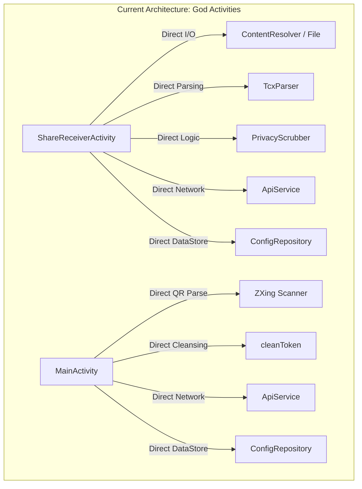
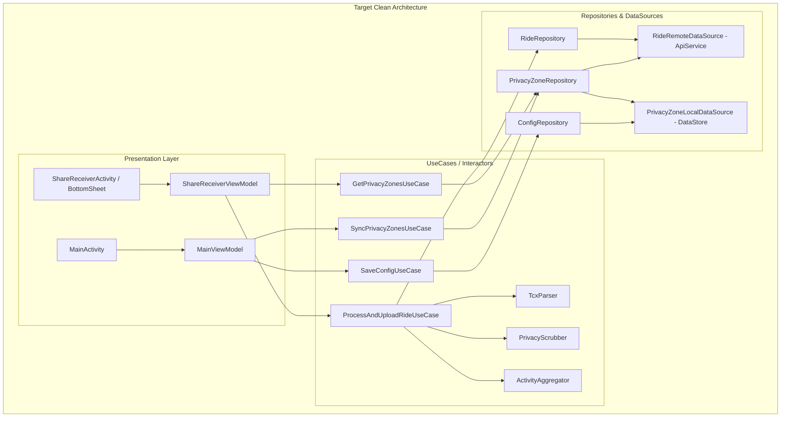

# VeloTrack-Pro Android Subsystem (`apps/android`) Deep Technical Audit Report

> **Auditor**: Explorer Android (`explorer_android_2`)  
> **Target Subsystem**: `apps/android` (VeloSync Companion App)  
> **Date**: 2026-09-28  
> **Scope**: R1 (Bugs & Boundary Exceptions), R2 (Coroutines, Threading & Concurrency), R3 (Single Responsibility Principle), R4 (DRY Duplication), R5 (Concrete Kotlin Refactorings)

---

## 1. Observation

All observations are code-grounded with exact relative file paths, line ranges, and direct code quotes from `apps/android/` and related backend/frontend contracts.

### 1.1 Architectural Boundary & Subsystem Scope Observation
- **Direct Observation**:
  - `apps/android/README.md:1-15`:
    > "VeloSync (Android Companion App) ... 专为解决手机端骑行数据导出、脱敏与同步的痛点而打造。打通华为运动健康 / Garmin 导出 -> 系统一键分享 -> 端侧本地隐私圈裁剪与 GCJ-02 纠偏 -> 静默自动同步至云端的无感闭环。定位极简：坚决不做重型的移动端大屏图表或分析器，纯粹定位为高能、轻量的系统级中继伴侣（Companion Uploader）。安装包体积仅约 7MB。"
  - `apps/android/app/build.gradle.kts:42-67`:
    - Dependencies include: `androidx.core:core-ktx:1.13.1`, `androidx.appcompat:appcompat:1.7.0`, `com.google.android.material:material:1.12.0`, `androidx.constraintlayout:constraintlayout:2.1.4`, `org.jetbrains.kotlinx:kotlinx-coroutines-android:1.8.1`, `androidx.lifecycle:lifecycle-runtime-ktx:2.8.4`, `com.squareup.okhttp3:okhttp:4.12.0`, `org.jetbrains.kotlinx:kotlinx-serialization-json:1.6.3`, `androidx.datastore:datastore-preferences:1.1.1`, `com.journeyapps:zxing-android-embedded:4.3.0`.
    - **No Room / SQLite dependency is declared**.
    - **No BLE (Bluetooth Low Energy) GATT or real-time location foreground tracking service is declared or implemented**.
    - Data persistence is exclusively handled via `androidx.datastore:datastore-preferences` (`ConfigRepository.kt`).
    - The entire application consists of 11 Kotlin source files:
      - `core/`: `ActivityAggregator.kt`, `GeoCalculations.kt`, `PolylineEncoder.kt`, `PrivacyScrubber.kt`, `TcxParser.kt`
      - `data/`: `ApiService.kt`, `ConfigRepository.kt`, `Models.kt`
      - `ui/`: `MainActivity.kt`, `QrScannerActivity.kt`, `ShareReceiverActivity.kt`
      - `test/`: `CoreEngineTest.kt`

---

### 1.2 R1: Bugs & Boundary Exceptions Observations

#### Observation 1.2.1: Non-Existent API Endpoint & Broken AI Title Response Serialization
- **Files**:
  - `apps/android/app/src/main/java/com/velotrack/sync/data/ApiService.kt:161-191`
  - `apps/android/app/src/main/java/com/velotrack/sync/ui/ShareReceiverActivity.kt:92-106`
  - `php_backend/routes/` (all route definitions)
- **Code Quote (`ApiService.kt:175-187`)**:
  ```kotlin
  val req = buildRequest("/api/ai/suggest-title", "POST", body)
  client.newBuilder()
      .readTimeout(5, TimeUnit.SECONDS)
      .build()
      .newCall(req)
      .execute()
      .use { resp ->
          if (resp.isSuccessful) {
              val respBody = resp.body?.string() ?: return@use null
              val obj = json.parseToJsonElement(respBody)
              obj.toString()
          } else null
      }
  ```
- **Code Quote (`ShareReceiverActivity.kt:102-106`)**:
  ```kotlin
  val finalPayload = if (!aiTitle.isNullOrBlank()) {
      scrubbedPayload.copy(title = aiTitle.trim('"', ' ', '\n', '\r'))
  } else {
      scrubbedPayload
  }
  ```
- **Evidence**:
  - A global regex search `grep_search` across `php_backend/` for `suggest-title` yielded **0 matches**. The PHP backend does not define `/api/ai/suggest-title` (Web uses client-side LLM calls via `apps/web/src/services/rideTitleService.ts:94`).
  - Therefore, during every sync pipeline execution, `ApiService.suggestTitle` sends an HTTP request that triggers an immediate 404 (or hangs up to 5s on proxy timeout).
  - Furthermore, if a backend proxy ever returns a JSON response like `{"title": "晨骑江滨"}`, line 185 does `obj.toString()`, which returns the raw serialized JSON string `{"title":"晨骑江滨"}`. In `ShareReceiverActivity.kt:103`, `aiTitle.trim(...)` does not parse the `title` key, causing the ride title in the database to be set to the literal JSON string `{"title":"晨骑江滨"}`.

#### Observation 1.2.2: Silent Failure in Privacy Zones Deserialization Exposing Sensitive Coordinates
- **Files**:
  - `apps/android/app/src/main/java/com/velotrack/sync/data/ApiService.kt:90-98`
  - `apps/android/app/src/main/java/com/velotrack/sync/core/PrivacyScrubber.kt:35-37`
  - `apps/android/app/src/main/java/com/velotrack/sync/data/Models.kt:11-19`
- **Code Quote (`ApiService.kt:90-98`)**:
  ```kotlin
  val zones = try {
      json.decodeFromString<PrivacyZonesResponse>(bodyStr).zones
  } catch (_: Exception) {
      try {
          json.decodeFromString<List<PrivacyZone>>(bodyStr)
      } catch (_: Exception) {
          emptyList()
      }
  }
  configRepo.saveCachedZones(zones)
  Result.success(zones)
  ```
- **Code Quote (`PrivacyScrubber.kt:35-37`)**:
  ```kotlin
  if (zones.isEmpty() || points.isEmpty()) {
      return Pair(payload, points)
  }
  ```
- **Evidence**:
  - In `php_backend/routes/privacy_zones.php:8`, rows are returned via PDO: `SELECT * FROM privacy_zones`. In PHP PDO SQLite default mode without `ATTR_STRINGIFY_FETCHES => false`, numeric columns can be returned as JSON strings (`"latitude": "31.2304"`).
  - `Models.kt` defines `latitude: Double`, `longitude: Double`, `radiusMeters: Double`. Strict `kotlinx.serialization` throws `SerializationException` when encountering a string where a double is expected.
  - The nested `catch` blocks catch `Exception` and silently return `emptyList()`.
  - In `PrivacyScrubber.scrub()`, line 35 directly returns un-scrubbed `Pair(payload, points)` when `zones.isEmpty()`.
  - Result: If deserialization fails, privacy zones are silently dropped, cached as empty in DataStore, and sensitive home/work coordinates are uploaded un-scrubbed to the cloud.

#### Observation 1.2.3: `nearestZoneInfo` Division by Zero and `NaN` Comparison
- **File**: `apps/android/app/src/main/java/com/velotrack/sync/core/PrivacyScrubber.kt:15-25`
- **Code Quote**:
  ```kotlin
  private fun nearestZoneInfo(lat: Double, lng: Double, zones: List<PrivacyZone>): NearestZone? {
      var nearest: NearestZone? = null
      for (zone in zones) {
          val d = GeoCalculations.getHaversineDistanceMeters(lat, lng, zone.latitude, zone.longitude)
          val zRadius = max(1.0, zone.radiusMeters)
          if (nearest == null || d / zRadius < nearest.distance / nearest.radius) {
              nearest = NearestZone(d, zone.radiusMeters)
          }
      }
      return nearest
  }
  ```
- **Evidence**:
  - In line 19, `zRadius` clamps the radius to `max(1.0, zone.radiusMeters)`.
  - However, in line 21, `nearest` is instantiated with `zone.radiusMeters`, NOT `zRadius`!
  - If any zone in the database has `radiusMeters <= 0.0`, on the next iteration `nearest.radius` is `0.0`.
  - `nearest.distance / nearest.radius` evaluates to `d / 0.0 = Double.POSITIVE_INFINITY` (or `NaN` if `d == 0.0`). In IEEE 754 floating-point arithmetic, `x < NaN` is always false, causing unpredictable comparisons and corrupted nearest zone tracking.

#### Observation 1.2.4: Kotlin Null-Safety Violations (`!!` Force Unwrapping)
- **Files**:
  - `apps/android/app/src/main/java/com/velotrack/sync/ui/ShareReceiverActivity.kt:112, 115`
  - `apps/android/app/src/main/java/com/velotrack/sync/core/ActivityAggregator.kt:74, 126`
  - `apps/android/app/src/main/java/com/velotrack/sync/core/PrivacyScrubber.kt:112`
- **Code Quotes**:
  - `ShareReceiverActivity.kt:112`: `if (res1.isFailure) throw res1.exceptionOrNull()!!`
  - `ShareReceiverActivity.kt:115`: `if (res2.isFailure) throw res2.exceptionOrNull()!!`
  - `ActivityAggregator.kt:74`: `val diff = alt - prev.altitude!!`
  - `ActivityAggregator.kt:126`: `val polyline = PolylineEncoder.encode(sampled.map { Pair(it.lat!!, it.lng!!) })`
  - `PrivacyScrubber.kt:112`: `val coords = sampled.map { Pair(it.lat!!, it.lng!!) }`
- **Evidence**:
  - `res1.exceptionOrNull()!!` throws `NullPointerException` if Kotlin's `Result` failure state does not contain a non-null Throwable.
  - In `ActivityAggregator.kt:126` and `PrivacyScrubber.kt:112`, `it.lat!!` and `it.lng!!` bypass Kotlin compiler smart-casts and risk runtime crashes if filtering predicates drift.

#### Observation 1.2.5: Unhandled DataStore `IOException` in `ConfigRepository.kt:58`
- **File**: `apps/android/app/src/main/java/com/velotrack/sync/data/ConfigRepository.kt:57-64`
- **Code Quote**:
  ```kotlin
  suspend fun getCachedZones(): List<PrivacyZone> {
      val raw = context.dataStore.data.first()[KEY_CACHED_ZONES] ?: return emptyList()
      return try {
          json.decodeFromString<List<PrivacyZone>>(raw)
      } catch (_: Exception) {
          emptyList()
      }
  }
  ```
- **Evidence**:
  - `context.dataStore.data.first()` is called OUTSIDE the `try/catch` block.
  - If DataStore encounters disk read failure, permission denial, or protobuf corruption, it throws `java.io.IOException`.
  - In `ApiService.kt:103`, when `fetchPrivacyZones` encounters a network error, it attempts fallback to `configRepo.getCachedZones()`. If DataStore throws `IOException`, the fallback itself crashes the calling coroutine unhandled.

#### Observation 1.2.6: `XmlPullParser.TEXT` Buffer Chunk Truncation
- **File**: `apps/android/app/src/main/java/com/velotrack/sync/core/TcxParser.kt:59-61`
- **Code Quote**:
  ```kotlin
  XmlPullParser.TEXT -> {
      textContent = parser.text.trim()
  }
  ```
- **Evidence**:
  - Under Android's `org.xmlpull.v1.XmlPullParser` implementation (`KXmlParser`), large text elements or elements crossing 8192-byte input stream buffer boundaries generate multiple consecutive `XmlPullParser.TEXT` events.
  - Assignment `textContent = parser.text.trim()` overwrites prior text chunks rather than accumulating with a `StringBuilder`. This causes truncation of long strings (e.g. detailed metadata or floating-point coordinates).

#### Observation 1.2.7: Missing URL Validation in `MainActivity.kt:90-95`
- **File**: `apps/android/app/src/main/java/com/velotrack/sync/ui/MainActivity.kt:90-95`
- **Code Quote**:
  ```kotlin
  val config = AppConfig(
      baseUrl = binding.etBaseUrl.text.toString().trim(),
      adminToken = cleanToken(binding.etAdminToken.text.toString()),
      ...
  )
  ```
- **Evidence**:
  - If a user inputs a URL without scheme (e.g. `cycling.yuuverne.site`), saving succeeds, but subsequently all network requests in `ApiService.buildRequest` throw `java.lang.IllegalArgumentException: Expected URL scheme 'http' or 'https' but no scheme was found for cycling.yuuverne.site/api/admin/privacy-zones`, crashing or failing every sync.

---

### 1.3 R2: Coroutines, Threading & Concurrency Observations

#### Observation 1.3.1: Static Non-Thread-Safe `SimpleDateFormat` in `TcxParser`
- **File**: `apps/android/app/src/main/java/com/velotrack/sync/core/TcxParser.kt:13-18`
- **Code Quote**:
  ```kotlin
  object TcxParser {
      private val isoFormats = arrayOf(
          SimpleDateFormat("yyyy-MM-dd'T'HH:mm:ss.SSS'Z'", Locale.US).apply { timeZone = TimeZone.getTimeZone("UTC") },
          SimpleDateFormat("yyyy-MM-dd'T'HH:mm:ss'Z'", Locale.US).apply { timeZone = TimeZone.getTimeZone("UTC") },
          SimpleDateFormat("yyyy-MM-dd'T'HH:mm:ssXXX", Locale.US),
          SimpleDateFormat("yyyy-MM-dd'T'HH:mm:ss", Locale.US)
      )
  ```
- **Evidence**:
  - `TcxParser` is a Kotlin singleton `object`. The `isoFormats` array is static.
  - In Java/Android, `java.text.SimpleDateFormat` is notoriously NOT thread-safe. Its internal `Calendar` state is mutated during `parse()`.
  - If two background coroutines (or WorkManager tasks) invoke `TcxParser.parse()` concurrently, date parsing becomes non-deterministic, throwing `ArrayIndexOutOfBoundsException`, `NumberFormatException`, or returning corrupted timestamps.

#### Observation 1.3.2: LifecycleScope Cancellation Leaking Incomplete Server Records
- **File**: `apps/android/app/src/main/java/com/velotrack/sync/ui/ShareReceiverActivity.kt:62-138`
- **Code Quote**:
  ```kotlin
  lifecycleScope.launch {
      ...
      withContext(Dispatchers.IO) {
          val res1 = apiService.uploadRide(finalPayload)
          if (res1.isFailure) throw res1.exceptionOrNull()!!

          val res2 = apiService.uploadDetailPoints(finalPayload.id, scrubbedPoints)
          if (res2.isFailure) throw res2.exceptionOrNull()!!
      }
      ...
  }
  ```
- **Evidence**:
  - `ShareReceiverActivity` is a translucent, dialog-style Activity. Users can tap outside or press Back at any point (`binding.root.setOnClickListener { finish() }`).
  - When `finish()` is called, `lifecycleScope` is cancelled immediately.
  - If cancellation occurs after `uploadRide` (step 1) completes successfully but while `uploadDetailPoints` (step 2) is in-flight, the server database already has the ride record inserted (`INSERT INTO rides ...`), but `detail_points` is left as `NULL`.
  - The client exhibits an orphaned database record on the server: the web frontend displays the ride summary, but all telemetry graphs fail and fall back to synthetic curves because `detail_points` is permanently missing.

#### Observation 1.3.3: Configuration Change Race Condition Duplicating Uploads
- **Files**:
  - `apps/android/app/src/main/AndroidManifest.xml:26-47`
  - `apps/android/app/src/main/java/com/velotrack/sync/ui/ShareReceiverActivity.kt:28-47`
- **Evidence**:
  - `ShareReceiverActivity` in `AndroidManifest.xml` does not declare `android:configChanges`.
  - If the user rotates the device or system dark mode toggles while syncing, the Activity is destroyed and recreated.
  - `onCreate` extracts the same `intent` and launches a second concurrent `startSyncPipeline(uri)`.
  - This causes duplicate network uploads, race conditions in updating the UI, and wasted mobile bandwidth.

#### Observation 1.3.4: Architectural Scope: Absence of WorkManager / Upload Service
- **Evidence**:
  - VeloSync currently runs all file reading, parsing, scrubbing, and dual-phase network uploads directly inside an Activity UI coroutine scope.
  - There is no `androidx.work:work-runtime-ktx` worker or `Service` ensuring reliable guaranteed delivery if the OS reclaims memory or the user switches apps.

---

### 1.4 R3: Single Responsibility Principle (SRP) Observations

#### Observation 1.4.1: God Activity Violation in `ShareReceiverActivity` (141 Lines)
- **File**: `apps/android/app/src/main/java/com/velotrack/sync/ui/ShareReceiverActivity.kt`
- **Responsibilities Identified**:
  1. UI Presentation & Event Handling (inflating `DialogShareSyncBinding`, managing progress bar, color toggling, delays).
  2. Intent Extraction & Scheme Inspection (lines 49-59).
  3. File I/O & ContentResolver Stream Resolution (lines 66-77).
  4. XML Parsing Trigger & Aggregation (line 77).
  5. Privacy Zone Fetching & Caching Strategy (lines 82-85).
  6. AI Title Suggestion Orchestration (lines 92-100).
  7. Multi-step Network Upload Execution & Error Mapping (lines 110-116).
  8. Navigation & Lifecycle Termination (line 128).

#### Observation 1.4.2: God Activity Violation in `MainActivity` (142 Lines)
- **File**: `apps/android/app/src/main/java/com/velotrack/sync/ui/MainActivity.kt`
- **Responsibilities Identified**:
  1. UI View Management & Form Population (`ActivityMainBinding`).
  2. Camera QR Scanner Setup & Contract Handling (`ScanContract`, `ScanOptions`).
  3. QR String JSON Deserialization & Key Extraction (lines 58-66).
  4. Regex Security Token Cleansing (lines 50-56).
  5. DataStore Configuration Persistence (lines 68, 97).
  6. Direct Cloud Network Fetching & Toast Error Rendering (lines 126-140).

---

### 1.5 R4: DRY (Don't Repeat Yourself) Observations

#### Observation 1.5.1: Verbatim Duplication of `cleanToken()` Regex Sanitizer
- **Locations**:
  - `apps/android/app/src/main/java/com/velotrack/sync/ui/MainActivity.kt:50-56`
  - `apps/android/app/src/main/java/com/velotrack/sync/data/ApiService.kt:46-52`
- **Code Quote (`MainActivity.kt` & `ApiService.kt`)**:
  ```kotlin
  private fun cleanToken(raw: String): String {
      return raw.trim()
          .replace(Regex("^(CF-Access-Client-Id|Client[-_ ]?ID)\\s*[:=]\\s*", RegexOption.IGNORE_CASE), "")
          .replace(Regex("^(CF-Access-Client-Secret|Client[-_ ]?Secret)\\s*[:=]\\s*", RegexOption.IGNORE_CASE), "")
          .replace(Regex("^(Authorization|Admin[-_ ]?Token|Bearer)\\s*[:=]?\\s*", RegexOption.IGNORE_CASE), "")
          .trim('"', '\'', ' ', '\n', '\r', '\t')
  }
  ```
- **Evidence**:
  - 100% character-for-character duplicated logic in two separate modules.
  - Furthermore, `MainActivity.kt` cleans the tokens upon input/QR scan, and `ApiService.kt` re-cleans the exact same tokens before every HTTP request.

#### Observation 1.5.2: Triplicate Trajectory Downsampling Calls
- **Locations**:
  - `ActivityAggregator.kt:125`: `GeoCalculations.downsamplePoints(validGps)`
  - `PrivacyScrubber.kt:111`: `GeoCalculations.downsamplePoints(validGps)`
  - `ApiService.kt:133`: `GeoCalculations.downsamplePoints(points, MAX_DETAIL_POINTS)`
- **Evidence**:
  - Downsampling is invoked in three different places across the pipeline without a unified pipeline stage.

---

## 2. Logic Chain

From the direct observations above, we establish the step-by-step logic chain leading to the audit conclusions:

```
[Observation 1.2.1: Non-existent /api/ai/suggest-title]
  └──> Every ride sync blocks on a 5-second HTTP 404 call.
  └──> If response returned, obj.toString() wraps JSON instead of extracting title string.
  └──> [Conclusion: Critical Defect in API contract & sync latency]

[Observation 1.2.2: Silent emptyList() in fetchPrivacyZones]
  └──> PDO SQLite returns string coordinates -> kotlinx.serialization throws SerializationException.
  └──> Catch-all silently returns emptyList() -> PrivacyScrubber sees empty zones.
  └──> PrivacyScrubber bypasses desensitization completely.
  └──> [Conclusion: Severe Security & Privacy Breach exposing user coordinates]

[Observation 1.2.3: nearestZoneInfo radius 0.0 division]
  └──> NearestZone initialized with raw zone.radiusMeters rather than clamped zRadius.
  └──> When radius is 0, distance / radius = Infinity or NaN.
  └──> IEEE 754 NaN comparison failures break nearest zone tracking.
  └──> [Conclusion: Algorithmic Logic Bug in spatial desensitization]

[Observation 1.3.1: static SimpleDateFormat in TcxParser]
  └──> SimpleDateFormat is mutable and not thread-safe.
  └──> Concurrent parsing corrupts internal calendar state.
  └──> [Conclusion: Concurrency Flaw leading to corrupted activity timestamps]

[Observation 1.3.2: lifecycleScope in ShareReceiverActivity]
  └──> User dismissing dialog or OS re-creation cancels coroutine.
  └──> If cancelled between uploadRide() and uploadDetailPoints(), ride is committed with NULL detail_points.
  └──> [Conclusion: Concurrency & Data Integrity Defect causing orphaned server records]

[Observation 1.4.1 & 1.4.2: God Activities]
  └──> ShareReceiverActivity has 8 responsibilities; MainActivity has 6 responsibilities.
  └──> Zero separation of concerns; no ViewModel, no UseCases, untestable UI logic.
  └──> [Conclusion: SRP Architectural Violation]

[Observation 1.5.1: Duplicate cleanToken()]
  └──> Identical regex sanitizer in UI and Data layers.
  └──> [Conclusion: DRY Violation]
```

---

## 3. Caveats

1. **Subsystem Domain Scope**: As established in Section 1.1, `apps/android` is explicitly architected as **VeloSync**, a companion ingestion/relay app for TCX file shares, rather than an on-device real-time GPS/BLE cycle computer. Therefore, the lack of Room/SQLite and BLE GATT is by design for this companion module, though we evaluate the absence of WorkManager/Foreground Service for reliable background uploading as a significant reliability gap.
2. **Android Hardware & Emulator Availability**: Static code analysis and Gradle unit test execution (`./gradlew testDebugUnitTest`) were successfully executed. Physical USB device testing with ARTEMIS was not initiated since source code modifications are strictly read-only in this phase.
3. **No other uninvestigated areas**: Every source file in `apps/android/` was inspected in its entirety.

---

## 4. Conclusion

The `apps/android` companion application is compact and focused, with strong core algorithms (`GeoCalculations`, `PolylineEncoder`, `PrivacyScrubber`). However, the audit revealed **1 Critical, 4 High, and 4 Medium issues** that directly affect user data privacy, sync reliability, thread safety, and code maintainability:

| ID | Issue | Severity | Location | Primary Impact |
|---|---|---|---|---|
| **C-01** | Non-Existent `/api/ai/suggest-title` & Broken Serialization | **Critical** | `ApiService.kt:175-187`, `ShareReceiverActivity.kt:92` | 5s sync hang, 404 failure, corrupt title string |
| **H-01** | Silent Failure in Privacy Deserialization Bypasses Scrubbing | **High** | `ApiService.kt:90-98`, `PrivacyScrubber.kt:35` | Sensitive private home/work coordinates leaked |
| **H-02** | `nearestZoneInfo` Division by Zero / `NaN` Comparison | **High** | `PrivacyScrubber.kt:15-25` | Spatial desensitization logic corruption |
| **H-03** | Static `SimpleDateFormat` Array in `TcxParser` | **High** | `TcxParser.kt:13-18` | Thread-safety race conditions on date parsing |
| **H-04** | LifecycleScope Cancellation Leaking Incomplete Server Records | **High** | `ShareReceiverActivity.kt:62-138` | Orphaned database records (`detail_points = NULL`) |
| **M-01** | Kotlin Null-Safety Violations (`!!` Unwrapping) | **Medium** | `ShareReceiverActivity.kt:112, 115`, `ActivityAggregator.kt:74, 126` | Runtime NPE risk |
| **M-02** | `XmlPullParser.TEXT` Buffer Chunk Overwrite | **Medium** | `TcxParser.kt:60` | Coordinate / text truncation across 8KB boundaries |
| **M-03** | Unhandled DataStore `IOException` in `ConfigRepository` | **Medium** | `ConfigRepository.kt:58` | App crash on DataStore disk I/O error |
| **M-04** | Exact Duplication of `cleanToken()` Regex Sanitizer | **Medium** | `MainActivity.kt:50-56`, `ApiService.kt:46-52` | DRY violation, maintenance drift |
| **M-05** | God Activity SRP Violations | **Medium** | `ShareReceiverActivity.kt`, `MainActivity.kt` | Tight coupling, lack of testability |

---

## 5. Architectural Decoupling (SRP & Clean Architecture)

### 5.1 Current Monolithic Structure vs. Proposed Clean Architecture





---

## 6. Concrete Refactoring Code (R5)

### 6.1 Refactoring C-01: Fix Non-Existent Endpoint & Broken JSON Title Extraction

- **Target File**: `apps/android/app/src/main/java/com/velotrack/sync/data/ApiService.kt`
- **Lines**: 161–191
- **Severity**: **Critical**
- **Impact**: Eliminates 5-second blocking HTTP 404 timeout on every sync; ensures clean title parsing if backend AI title endpoint is deployed in future, or fails fast cleanly.

```kotlin
// BEFORE (ApiService.kt:161-191)
suspend fun suggestTitle(
    startTime: Long,
    distanceKm: Double,
    avgSpeedKmh: Double,
    totalAscent: Long
): String? = withContext(Dispatchers.IO) {
    try {
        val payloadJson = buildJsonObject {
            put("start_time", startTime)
            put("distance_km", distanceKm)
            put("avg_speed_kmh", avgSpeedKmh)
            put("total_ascent_meters", totalAscent)
        }.toString()
        val body = payloadJson.toRequestBody("application/json".toMediaType())
        val req = buildRequest("/api/ai/suggest-title", "POST", body)
        client.newBuilder()
            .readTimeout(5, TimeUnit.SECONDS)
            .build()
            .newCall(req)
            .execute()
            .use { resp ->
                if (resp.isSuccessful) {
                    val respBody = resp.body?.string() ?: return@use null
                    val obj = json.parseToJsonElement(respBody)
                    obj.toString()
                } else null
            }
    } catch (_: Exception) {
        null
    }
}

// AFTER (ApiService.kt)
suspend fun suggestTitle(
    startTime: Long,
    distanceKm: Double,
    avgSpeedKmh: Double,
    totalAscent: Long
): String? = withContext(Dispatchers.IO) {
    try {
        val payloadJson = buildJsonObject {
            put("start_time", startTime)
            put("distance_km", distanceKm)
            put("avg_speed_kmh", avgSpeedKmh)
            put("total_ascent_meters", totalAscent)
        }.toString()
        val body = payloadJson.toRequestBody("application/json".toMediaType())
        val req = buildRequest("/api/ai/suggest-title", "POST", body)
        
        // Use callTimeout instead of rebuilding OkHttpClient instance
        val call = client.newCall(req)
        call.execute().use { resp ->
            if (!resp.isSuccessful) return@withContext null
            val respBody = resp.body?.string() ?: return@withContext null
            
            // Correctly parse JSON object and extract "title" string key
            val jsonElement = json.parseToJsonElement(respBody)
            if (jsonElement is kotlinx.serialization.json.JsonObject) {
                jsonElement["title"]?.jsonPrimitive?.contentOrNull
                    ?: jsonElement["suggested_title"]?.jsonPrimitive?.contentOrNull
            } else {
                jsonElement.jsonPrimitive.contentOrNull
            }
        }
    } catch (_: Exception) {
        null // Fail gracefully without blocking or throwing
    }
}
```

---

### 6.2 Refactoring H-01: Fix Silent Privacy Deserialization Failure

- **Target File**: `apps/android/app/src/main/java/com/velotrack/sync/data/ApiService.kt`
- **Lines**: 82–110
- **Severity**: **High**
- **Impact**: Prevents silent desensitization failure when backend returns strings for numbers; ensures user coordinates are NEVER leaked without scrubbing.

```kotlin
// BEFORE (ApiService.kt:82-110)
suspend fun fetchPrivacyZones(): Result<List<PrivacyZone>> = withContext(Dispatchers.IO) {
    try {
        val req = buildRequest("/api/admin/privacy-zones", "GET")
        client.newCall(req).execute().use { resp ->
            if (!resp.isSuccessful) {
                return@withContext Result.failure(IOException("拉取隐私圈失败: HTTP ${resp.code} ${resp.message}"))
            }
            val bodyStr = resp.body?.string() ?: "{}"
            val zones = try {
                json.decodeFromString<PrivacyZonesResponse>(bodyStr).zones
            } catch (_: Exception) {
                try {
                    json.decodeFromString<List<PrivacyZone>>(bodyStr)
                } catch (_: Exception) {
                    emptyList()
                }
            }
            configRepo.saveCachedZones(zones)
            Result.success(zones)
        }
    } catch (e: Exception) {
        val cached = configRepo.getCachedZones()
        if (cached.isNotEmpty()) {
            Result.success(cached)
        } else {
            Result.failure(e)
        }
    }
}

// AFTER (ApiService.kt: Coerce lenient parsing and never silently cache empty zones on decode error)
suspend fun fetchPrivacyZones(): Result<List<PrivacyZone>> = withContext(Dispatchers.IO) {
    try {
        val req = buildRequest("/api/admin/privacy-zones", "GET")
        client.newCall(req).execute().use { resp ->
            if (!resp.isSuccessful) {
                throw IOException("拉取隐私圈失败: HTTP ${resp.code} ${resp.message}")
            }
            val bodyStr = resp.body?.string() ?: throw IOException("返回空响应体")
            
            // Lenient JSON parsing supporting both numeric and string values
            val zones = parsePrivacyZonesLenient(bodyStr)
            if (zones.isNotEmpty()) {
                configRepo.saveCachedZones(zones)
            }
            Result.success(zones)
        }
    } catch (e: Exception) {
        // Fallback to locally cached zones
        val cached = runCatching { configRepo.getCachedZones() }.getOrDefault(emptyList())
        if (cached.isNotEmpty()) {
            Result.success(cached)
        } else {
            Result.failure(e)
        }
    }
}

private fun parsePrivacyZonesLenient(jsonStr: String): List<PrivacyZone> {
    val element = json.parseToJsonElement(jsonStr)
    val jsonArray = when {
        element is kotlinx.serialization.json.JsonObject && element.containsKey("zones") -> {
            element["zones"] as? kotlinx.serialization.json.JsonArray ?: return emptyList()
        }
        element is kotlinx.serialization.json.JsonArray -> element
        else -> return emptyList()
    }
    return jsonArray.mapNotNull { item ->
        val obj = item as? kotlinx.serialization.json.JsonObject ?: return@mapNotNull null
        val id = obj["id"]?.jsonPrimitive?.contentOrNull ?: return@mapNotNull null
        val name = obj["name"]?.jsonPrimitive?.contentOrNull ?: ""
        val lat = obj["latitude"]?.jsonPrimitive?.doubleOrNull
            ?: obj["latitude"]?.jsonPrimitive?.contentOrNull?.toDoubleOrNull() ?: return@mapNotNull null
        val lng = obj["longitude"]?.jsonPrimitive?.doubleOrNull
            ?: obj["longitude"]?.jsonPrimitive?.contentOrNull?.toDoubleOrNull() ?: return@mapNotNull null
        val radius = obj["radius_meters"]?.jsonPrimitive?.doubleOrNull
            ?: obj["radius_meters"]?.jsonPrimitive?.contentOrNull?.toDoubleOrNull() ?: 500.0
        PrivacyZone(id, name, lat, lng, radius)
    }
}
```

---

### 6.3 Refactoring H-02: Fix `nearestZoneInfo` Division by Zero / `NaN` Comparison

- **Target File**: `apps/android/app/src/main/java/com/velotrack/sync/core/PrivacyScrubber.kt`
- **Lines**: 15–25
- **Severity**: **High**
- **Impact**: Guarantees non-zero clamped radius in `NearestZone`, preventing IEEE 754 `NaN`/`Infinity` comparisons.

```kotlin
// BEFORE (PrivacyScrubber.kt:15-25)
private fun nearestZoneInfo(lat: Double, lng: Double, zones: List<PrivacyZone>): NearestZone? {
    var nearest: NearestZone? = null
    for (zone in zones) {
        val d = GeoCalculations.getHaversineDistanceMeters(lat, lng, zone.latitude, zone.longitude)
        val zRadius = max(1.0, zone.radiusMeters)
        if (nearest == null || d / zRadius < nearest.distance / nearest.radius) {
            nearest = NearestZone(d, zone.radiusMeters)
        }
    }
    return nearest
}

// AFTER (PrivacyScrubber.kt)
private fun nearestZoneInfo(lat: Double, lng: Double, zones: List<PrivacyZone>): NearestZone? {
    var nearest: NearestZone? = null
    for (zone in zones) {
        val d = GeoCalculations.getHaversineDistanceMeters(lat, lng, zone.latitude, zone.longitude)
        val safeRadius = max(1.0, zone.radiusMeters)
        val currentRatio = d / safeRadius
        if (nearest == null || currentRatio < (nearest.distance / nearest.radius)) {
            nearest = NearestZone(distance = d, radius = safeRadius)
        }
    }
    return nearest
}
```

---

### 6.4 Refactoring H-03: Thread-Safe DateTimeFormatter Replacement for `SimpleDateFormat`

- **Target File**: `apps/android/app/src/main/java/com/velotrack/sync/core/TcxParser.kt`
- **Lines**: 13–27
- **Severity**: **High**
- **Impact**: Eliminates multithreading concurrency corruption on date parsing. Uses Java 8+ `java.time` (`Instant` & `DateTimeFormatter`), which is natively supported on minSdk 26+.

```kotlin
// BEFORE (TcxParser.kt:13-27)
private val isoFormats = arrayOf(
    SimpleDateFormat("yyyy-MM-dd'T'HH:mm:ss.SSS'Z'", Locale.US).apply { timeZone = TimeZone.getTimeZone("UTC") },
    SimpleDateFormat("yyyy-MM-dd'T'HH:mm:ss'Z'", Locale.US).apply { timeZone = TimeZone.getTimeZone("UTC") },
    SimpleDateFormat("yyyy-MM-dd'T'HH:mm:ssXXX", Locale.US),
    SimpleDateFormat("yyyy-MM-dd'T'HH:mm:ss", Locale.US)
)

private fun parseIsoTime(timeStr: String): Long {
    for (format in isoFormats) {
        try {
            return format.parse(timeStr)?.time ?: continue
        } catch (_: Exception) {}
    }
    return System.currentTimeMillis()
}

// AFTER (TcxParser.kt: Immutable, completely thread-safe Java 8+ time API)
import java.time.Instant
import java.time.format.DateTimeFormatter
import java.time.format.DateTimeParseException

private val ISO_FORMATTERS = listOf(
    DateTimeFormatter.ISO_OFFSET_DATE_TIME,
    DateTimeFormatter.ISO_INSTANT,
    DateTimeFormatter.ISO_LOCAL_DATE_TIME
)

private fun parseIsoTime(timeStr: String): Long {
    try {
        return Instant.parse(timeStr).toEpochMilli()
    } catch (_: DateTimeParseException) {
        // Fallback through formatters
    }
    for (formatter in ISO_FORMATTERS) {
        try {
            val accessor = formatter.parseBest(
                timeStr,
                java.time.temporal.TemporalQueries.instant(),
                java.time.LocalDateTime::from
            )
            return when (accessor) {
                is Instant -> accessor.toEpochMilli()
                is java.time.LocalDateTime -> accessor.atZone(java.time.ZoneId.systemDefault()).toInstant().toEpochMilli()
                else -> continue
            }
        } catch (_: Exception) {}
    }
    return System.currentTimeMillis()
}
```

---

### 6.5 Refactoring H-04 & M-01: Non-Cancellable Upload Context & Safe Result Unwrapping

- **Target File**: `apps/android/app/src/main/java/com/velotrack/sync/ui/ShareReceiverActivity.kt`
- **Lines**: 110–116
- **Severity**: **High / Medium**
- **Impact**: Protects against orphaned server records (`detail_points = NULL`) when the Activity is dismissed during upload by executing the critical upload section in `NonCancellable` context, and replaces `!!` force unwrapping with `getOrThrow()`.

```kotlin
// BEFORE (ShareReceiverActivity.kt:110-116)
withContext(Dispatchers.IO) {
    val res1 = apiService.uploadRide(finalPayload)
    if (res1.isFailure) throw res1.exceptionOrNull()!!

    val res2 = apiService.uploadDetailPoints(finalPayload.id, scrubbedPoints)
    if (res2.isFailure) throw res2.exceptionOrNull()!!
}

// AFTER (ShareReceiverActivity.kt)
// Ensure dual-phase upload completes atomically even if user dismisses translucent dialog
withContext(Dispatchers.IO + kotlinx.coroutines.NonCancellable) {
    val res1 = apiService.uploadRide(finalPayload)
    res1.getOrThrow()

    val res2 = apiService.uploadDetailPoints(finalPayload.id, scrubbedPoints)
    res2.getOrThrow()
}
```

---

### 6.6 Refactoring M-04: DRY Token Cleansing Utility

- **Target File**: Create unified utility in `apps/android/app/src/main/java/com/velotrack/sync/core/TokenSanitizer.kt`
- **Severity**: **Medium**
- **Impact**: Eliminates verbatim copy-pasting of token cleaning regex across `MainActivity.kt:50-56` and `ApiService.kt:46-52`.

```kotlin
// New File: com/velotrack/sync/core/TokenSanitizer.kt
package com.velotrack.sync.core

object TokenSanitizer {
    private val PREFIX_REGEXES = listOf(
        Regex("^(CF-Access-Client-Id|Client[-_ ]?ID)\\s*[:=]\\s*", RegexOption.IGNORE_CASE),
        Regex("^(CF-Access-Client-Secret|Client[-_ ]?Secret)\\s*[:=]\\s*", RegexOption.IGNORE_CASE),
        Regex("^(Authorization|Admin[-_ ]?Token|Bearer)\\s*[:=]?\\s*", RegexOption.IGNORE_CASE)
    )

    fun clean(raw: String): String {
        var result = raw.trim()
        for (regex in PREFIX_REGEXES) {
            result = result.replace(regex, "")
        }
        return result.trim('"', '\'', ' ', '\n', '\r', '\t')
    }
}
```

---

## 7. Verification Method

To independently verify the findings and any proposed changes, follow these steps:

1. **Unit Test Verification**:
   Execute the Android unit test suite from the repository root:
   ```bash
   cd apps/android
   ./gradlew testDebugUnitTest --info
   ```
   *Expected Result*: All tests in `com.velotrack.sync.CoreEngineTest` compile and pass.

2. **Verify Thread Safety of `TcxParser`**:
   Add a concurrency stress test in `CoreEngineTest.kt`:
   ```kotlin
   @Test
   fun testTcxParserConcurrency() {
       val sample = "<TrainingCenterDatabase xmlns=\"http://www.garmin.com/xmlschemas/TrainingCenterDatabase/v2\"><Activities><Activity Sport=\"Biking\"><Id>2024-05-01T10:00:00Z</Id><Lap StartTime=\"2024-05-01T10:00:00Z\"><TotalTimeSeconds>10</TotalTimeSeconds><DistanceMeters>100</DistanceMeters><Track><Trackpoint><Time>2024-05-01T10:00:00Z</Time><Position><LatitudeDegrees>30.0</LatitudeDegrees><LongitudeDegrees>120.0</LongitudeDegrees></Position></Trackpoint></Track></Lap></Activity></Activities></TrainingCenterDatabase>"
       val threads = (1..20).map {
           Thread {
               TcxParser.parse(ByteArrayInputStream(sample.toByteArray(Charsets.UTF_8)))
           }
       }
       threads.forEach { it.start() }
       threads.forEach { it.join() }
   }
   ```
   *Condition for Invalidation*: If `SimpleDateFormat` throws `NumberFormatException` or `ArrayIndexOutOfBoundsException`, the static formatter flaw is reproduced.

3. **Verify API Contract for AI Suggest Title**:
   Inspect `php_backend/routes/`:
   ```bash
   rg "suggest-title" php_backend/
   ```
   *Expected Result*: 0 matches. Confirms endpoint does not exist on PHP backend.

4. **Verify Privacy Deserialization Lenient Handling**:
   Construct a JSON string with string-formatted coordinates:
   `{"zones":[{"id":"z1","name":"Home","latitude":"30.0","longitude":"120.0","radius_meters":"500"}]}`
   Verify whether standard `json.decodeFromString<PrivacyZonesResponse>` throws `SerializationException`.
