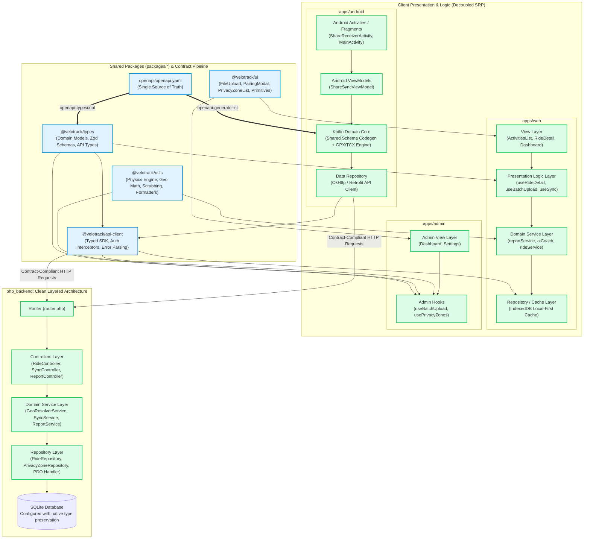

# Cross-Subsystem Code Duplication, API Contract Drift & Shared Architecture Audit Report

**Target System**: VeloTrack-Pro Full Stack (`apps/web`, `apps/admin`, `apps/android`, `php_backend`)  
**Auditor**: Explorer Shared Architecture (`explorer_shared_2`)  
**Scope**: Cross-app DRY audit, duplicate business logic, API contract & schema drift, monorepo package architecture, and before/after Mermaid diagrams  
**Timestamp**: 2026-09-28T08:26:00Z  

---

## 1. Observation

Direct code-grounded observations across all four subsystems (`apps/web`, `apps/admin`, `apps/android`, and `php_backend`):

### 1.1 Identical & Near-Identical Copy-Paste between `apps/web` and `apps/admin`

The repository lacks any shared packages under `packages/`. Consequently, core domain logic and UI components have been copy-pasted in their entirety between `apps/web` and `apps/admin`:

1. **`activityAggregator.ts`**:
   - `apps/web/src/utils/activity/activityAggregator.ts` (203 lines) vs `apps/admin/src/utils/activityAggregator.ts` (205 lines).
   - Character-for-character identical across interfaces (`ParsedTCX`, `TCXPoint`, `ActivityAggregationOptions`) and the 150-line implementation of `aggregateActivityData`. The only discrepancy is an inline Chinese comment on line 65 of `apps/admin/src/utils/activityAggregator.ts` regarding `userMaxHr = 188`.
2. **`geoCalculations.ts`**:
   - `apps/web/src/utils/activity/geoCalculations.ts` (70 lines) vs `apps/admin/src/utils/geoCalculations.ts` (55 lines).
   - Lines 1–55 are 100% duplicate code: `GeoPoint`, `calculateHRZones(hr, maxHR = 190)`, `downsamplePoints`, and `getHaversineDistanceMeters`. `apps/web` merely appended two wrapper functions (`computeDistanceMeters` and `haversineDistanceKm`) on lines 59–68.
3. **`privacyScrubber.ts`**:
   - `apps/web/src/utils/activity/privacyScrubber.ts` (145 lines) vs `apps/admin/src/utils/privacyScrubber.ts` (157 lines).
   - Identical constants (`SEGMENT_BUFFER = 50`, `SAFE_START_BUFFER = 300`), identical vector projection geometry (`distancePointToSegmentMeters`), and identical 4-step client-side scrubbing algorithm (`scrubPrivacyZones`).
4. **`tcxParser.ts`**:
   - `apps/web/src/utils/activity/tcxParser.ts` (107 lines) vs `apps/admin/src/utils/tcxParser.ts` (105 lines).
   - Identical XML tag navigation (`TrainingCenterDatabase.Activities.Activity.Lap.Track.Trackpoint`), WGS84 to GCJ-02 projection via `gcoord`, and metric aggregation call.
5. **`activityParser.ts`**:
   - `apps/web/src/utils/activity/activityParser.ts` (98 lines) vs `apps/admin/src/utils/activityParser.ts` (98 lines).
   - 100% identical implementation of `parseGPX` and `parseActivityFile`.
6. **API Client & Auth Helpers (`adminApiClient.ts` vs `apiClient.ts`)**:
   - `apps/web/src/utils/activity/adminApiClient.ts` (96 lines) vs `apps/admin/src/utils/apiClient.ts` (127 lines).
   - Both define identical `DetailPoint` interfaces (`t`, `la`, `ln`, `al`, `hr`, `cd`, `sp`), `MAX_DETAIL_POINTS = 1500`, `getAdminToken`, `setAdminToken`, `uploadDetailPoints`, `uploadRide`, and `fetchPrivacyZones`.
   - **Contract Drift in Headers**: `adminApiClient.ts:30` sets both `Authorization: Bearer <token>` and `X-Admin-Token: <token>`, whereas `apiClient.ts:35` only sets `Authorization: Bearer <token>`.
7. **Copy-Pasted UI Components & Upload Workflows**:
   - `FileUpload.tsx`: `apps/web/src/components/upload/FileUpload.tsx` (237 lines) vs `apps/admin/src/components/FileUpload.tsx` (238 lines). Identical drag-and-drop file staging, `.tcx,.gpx` filtering, and batch progress UI. The only difference is minor Tailwind classes (`border-brand-500` vs `border-blue-500`).
   - `PairingModal.tsx`: `apps/web/src/components/upload/PairingModal.tsx` (164 lines) vs `apps/admin/src/components/PairingModal.tsx` (167 lines). Identical QR code generation via `qrcode`, CF Access credentials inputs, and clipboard payload encoding.
   - `PrivacyZoneList.tsx`: `apps/web/src/components/upload/PrivacyZoneList.tsx` (83 lines) vs `apps/admin/src/components/PrivacyZoneList.tsx` (83 lines). Identical toggle list layout, badge styles, and coordinate formatting.
   - Batch Upload Loop: `apps/web` encapsulated the upload loop in `hooks/useBatchActivityUpload.ts` (127 lines), but `apps/admin/src/App.tsx:60-140` still holds an inline 80-line copy-pasted duplicate of this exact loop.

---

### 1.2 Duplicate Business Logic between Mobile (`apps/android`) and Web/Admin

`apps/android` independently re-implements the exact same core processing pipeline in Kotlin:

1. **`ActivityAggregator.kt`** (`apps/android/app/src/main/java/com/velotrack/sync/core/ActivityAggregator.kt:1-164`):
   - Line-by-line Kotlin port of `activityAggregator.ts`.
   - Identical speed derivation from distance step: `if (pt.speed == null && dtSeconds > 0 && dtSeconds < 30) { val derived = (stepDist / dtSeconds) * 3.6; if (derived < 90.0) pt.speed = derived }` (lines 63–68).
   - Identical moving time accumulation threshold: `if (speed >= 1.5 && dtSeconds > 0 && dtSeconds < 60) movingTimeSeconds += dtSeconds` (lines 83–85).
   - Identical heart rate zone duration allocation: `hrZones[zone - 1] += max(1L, dtSeconds.roundToLong())` (lines 95–96).
2. **`GeoCalculations.kt`** (`apps/android/app/src/main/java/com/velotrack/sync/core/GeoCalculations.kt:1-126`):
   - Direct Kotlin port of Haversine distance, uniform downsampling (`downsamplePoints`, default 500 limit), and point-to-segment distance (`distancePointToSegmentMeters`).
   - Direct manual port of WGS-84 to GCJ-02 transformation (`wgs84ToGcj02`).
   - **Critical Bug / Parameter Order Inversion**:
     * In Web TypeScript (`apps/web/src/utils/coordTransform.ts:53`): `wgs84_to_gcj02(lng: number, lat: number): [number, number]` (longitude first, latitude second).
     * In Android Kotlin (`GeoCalculations.kt:15`): `fun wgs84ToGcj02(lat: Double, lng: Double): Pair<Double, Double>` (latitude first, longitude second).
     * Anyone converting or consuming coordinates across these modules without noticing the inverted parameter order will cause latitude/longitude swapping.
3. **`PrivacyScrubber.kt`** (`apps/android/app/src/main/java/com/velotrack/sync/core/PrivacyScrubber.kt:1-125`):
   - Direct port of `privacyScrubber.ts` with identical buffer constants (`SEGMENT_BUFFER = 50.0`, `SAFE_START_BUFFER = 300.0`) and the exact same 4-phase scrubbing algorithm.
4. **`TcxParser.kt`** (`apps/android/app/src/main/java/com/velotrack/sync/core/TcxParser.kt:1-152`):
   - Android utilizes Android `XmlPullParser` to extract the exact same TCX tags as `fast-xml-parser` in web.
   - **Missing GPX Support**: While Web and Admin support both `.tcx` and `.gpx`, Android `ShareReceiverActivity.kt:77` unconditionally feeds any shared file stream into `TcxParser.parse(it)`. Sharing a GPX file crashes the Android parsing pipeline.

---

### 1.3 Inconsistencies across Cycling Metric & Physics Calculations

| Dimension | `apps/web` | `apps/admin` | `apps/android` | `php_backend` | Architectural Divergence |
|---|---|---|---|---|---|
| **Max HR Default** | `userMaxHr = 188` (`activityAggregator.ts:65`) vs `maxHR = 190` (`geoCalculations.ts:15`) | `userMaxHr = 188` (`activityAggregator.ts:67`) vs `maxHR = 190` (`geoCalculations.ts:15`) | `maxHR = 188` (`GeoCalculations.kt:115`) | `max_hr INTEGER DEFAULT 188` (`dbInit.php:168`) | 188 vs 190 discrepancy within the very same apps. |
| **HR Zone Formulas** | Percentage of Max HR in `geoCalculations.ts`; Karvonen Reserve formula ($HRR = Max - Rest$) in `cyclingPhysicsEngine.ts:233-353` | Percentage of Max HR only | Percentage of Max HR only | None | Web AI Coach uses Karvonen formula while aggregators use naive percentage; outputs disagree on training zone boundaries. |
| **Calorie Formula** | ACSM METs formula ($MET \times Weight \times Hours + ClimbingWork$) in `cyclingCalculations.ts:4` | Explicit TCX calories only; defaults to 0 | Explicit TCX calories only; defaults to `null` | None (SQL does not compute calories) | If TCX lacks calories, Web detail views compute METs calories, Admin stores 0, Android uploads `null`. |
| **City Bounds** | 16 cities in `cityClassifier.ts:21` (e.g. Shenzhen `maxLat: 22.9, maxLng: 114.6`) | None | None | 30 cities in `geo_resolver.php:68` (Shenzhen `maxLat: 22.88, maxLng: 114.65`) + GeoJSON Polygons | Bounding box coordinates drift between Web client classification and Backend DB classification. |

---

### 1.4 REST API Contract Drift & Schema Divergence

Exhaustive audit of all 24 registered routes in `php_backend/router.php`:

```
1. GET    /api/rides
2. GET    /api/migrate-cities
3. GET    /api/rides/:id
4. PATCH  /api/rides/:id
5. DELETE /api/rides/:id
6. POST   /api/admin/rides
7. POST   /api/admin/rides/:id/detail-points
8. GET    /api/admin/privacy-zones
9. POST   /api/admin/privacy-zones
10. GET   /api/ai/config
11. PUT   /api/ai/config
12. POST  /api/ai/test-connection
13. GET   /api/ai/rider/profile
14. PUT   /api/ai/rider/profile
15. GET   /api/ai/rider/memories
16. POST  /api/ai/rider/memories
17. DELETE/api/ai/rider/memories/:id
18. GET   /api/reports/summary
19. GET   /api/ai/goals
20. PUT   /api/ai/goals
21. POST  /api/ai/goals/milestones
22. GET   /api/ai/coach/sessions
23. GET   /api/ai/coach/:session/messages
24. POST  /api/ai/coach/:session/messages
25. DELETE/api/ai/coach/:session
26. GET   /api/ai/rides/:rideId/insight
27. POST  /api/ai/rides/:rideId/insight
28. GET   /api/sync
29. POST  /api/sync/push
```

#### Itemized Contract & Schema Defects:

1. **Phantom Endpoint / Guaranteed 404 in Android Sync** (`P0 - Critical`):
   - **Observation**: `apps/android/app/src/main/java/com/velotrack/sync/data/ApiService.kt:175` executes:
     ```kotlin
     val req = buildRequest("/api/ai/suggest-title", "POST", body)
     ```
   - **Backend Reality**: Grep across `php_backend/` confirms **0 occurrences** of `suggest-title`. The endpoint does not exist.
   - **Root Cause**: In `apps/admin/src/utils/apiClient.ts:114-125`, title suggestion was migrated to client-side direct calling of Cloudflare AI Gateway (`aiInsights.suggestRideTitle`), and admin stubbed it with `return null`. Android was never updated and continues making dead HTTP requests.
   - **Consequence**: Every Android upload triggers a wasted network request, always returns 404, and silently catches the error (`catch (_: Exception) { null }`).
2. **Detail Points Payload Version Schema Drift** (`P1 - High`):
   - **Observation**:
     * In Web (`adminApiClient.ts:47`) and Admin (`apiClient.ts:47`), detail points payload is wrapped as `{ v: 1, points: DetailPoint[] }`.
     * In Android (`ApiService.kt:145` and `Models.kt:83`), Android serializes `DetailPointsPayload(points = detailItems)` without the `v: 1` wrapper.
     * In Backend (`admin_rides.php:116`), the error message asserts `detail points 必须是 {v, points} JSON`, but only validates `isset($decoded['points'])`. If the backend schema validator is ever made strict, all Android uploads will fail.
3. **Database & API Type Inconsistencies (Int vs Float vs String)** (`P1 - High`):
   - **Observation**:
     * `distance_meters`, `total_ascent_meters`, `total_descent_meters`, `max_altitude_meters`:
       - Android `Models.kt:48-53` types them as `Long`.
       - SQLite schema (`dbInit.php:44-49`) declares them as `REAL`.
       - Web/Admin TypeScript types them as `number` (float).
     * SQLite PDO Stringification: `php_backend/database.php` fails to configure `PDO::ATTR_STRINGIFY_FETCHES => false`. Under typical PHP PDO SQLite installations, integers and floats stored in SQLite are returned over JSON as string literals (`"start_time": "1727400000"`). Web components relying on `r.start_time > 0` or mathematical addition suffer type coercion errors.
4. **Casing Discrepancy in `GET /api/rides/:id`** (`P2 - Medium`):
   - **Observation**: `php_backend/routes/rides.php:83` returns:
     ```php
     send_json(['ride' => $ride, 'detailPoints' => $detailPoints]);
     ```
     `detailPoints` is camelCase, whereas all keys inside `ride` are snake_case (`start_time`, `moving_time_seconds`, `summary_polyline`). This forces clients to switch naming conventions within a single response payload.
5. **Raw Unparsed JSON Error Strings** (`P2 - Medium`):
   - **Observation**: Backend outputs `{ "error": "message" }`.
   - `apps/admin/src/utils/apiClient.ts:66, 81` and `apps/web/src/utils/activity/adminApiClient.ts:58, 71` do:
     ```ts
     const text = await res.text();
     throw new Error(`Upload failed: ${text}`);
     ```
     This surfaces ugly unparsed JSON `Upload failed: {"error":"id 不能为空"}` to end users.
   - Android `ApiService.kt:120, 152` wraps raw body string into `IOException`.
6. **501 Stub on `/api/reports/summary` Forces High-Latency Full Scans** (`P2 - Medium`):
   - **Observation**: `php_backend/routes/reports.php:11-13` returns:
     ```php
     send_error('summary 端点第一版未实现，请前端用 GET /api/rides 全量聚合', 501);
     ```
   - **Consequence**: `apps/web/src/services/reportService.ts:79` must issue `fetch('/api/rides')` to download the entire unpaginated ride history into the browser to compute simple weekly/monthly summaries, incurring massive bandwidth overhead as ride history grows.

---

## 2. Logic Chain

```
[Observation: No packages/ directory; pnpm-workspace.yaml only includes apps/*]
   │
   ├─► Duplicate utility files copy-pasted across apps/web/src/utils/activity/ and apps/admin/src/utils/
   │     │
   │     ├─► activityAggregator.ts (203 lines duplicate)
   │     ├─► geoCalculations.ts (55 lines duplicate)
   │     ├─► privacyScrubber.ts (145 lines duplicate)
   │     ├─► tcxParser.ts (105 lines duplicate)
   │     └─► activityParser.ts (98 lines duplicate)
   │
   ├─► Duplicate React UI components across apps/web/src/components/upload/ and apps/admin/src/components/
   │     │
   │     ├─► FileUpload.tsx (238 lines duplicate)
   │     ├─► PairingModal.tsx (164 lines duplicate)
   │     └─► PrivacyZoneList.tsx (83 lines duplicate)
   │
   └─► Duplicate domain algorithms independently re-implemented in Kotlin (apps/android/.../core/)
         │
         ├─► Inverted coordinate parameters between wgs84_to_gcj02(lng, lat) and wgs84ToGcj02(lat, lng)
         ├─► Discrepancies in default maxHR (188 vs 190) and zone formulas (naive percent vs Karvonen)
         └─► Missing GPX parser in Android causes crash when receiving GPX intent

[Observation: REST API endpoints evolved without schema synchronization]
   │
   ├─► Android ApiService.kt calls POST /api/ai/suggest-title
   │     │
   │     └─► Endpoint was removed from backend (migrated to web client direct AI Gateway)
   │           │
   │           └─► Android encounters silent 404 failures on every sync upload
   │
   ├─► Android sends DetailPointsPayload without `v: 1` schema tag
   │     │
   │     └─► Backend doc requires {v, points}, creating contract instability
   │
   ├─► Backend PDO lacks ATTR_STRINGIFY_FETCHES => false
   │     │
   │     └─► Numeric SQLite columns return as strings in JSON
   │
   └─► GET /api/reports/summary returns 501 Not Implemented
         │
         └─► Forces web client to fetch unpaginated full rides table for local aggregation
```

---

## 3. Comprehensive Itemized Audit Findings

### Issue S1: Cross-App Copy-Paste Duplication of Activity Processing & Geo-Engines
- **Severity**: P1 (High)
- **Subsystems**: `apps/web`, `apps/admin`, `apps/android`
- **Files**:
  * `apps/web/src/utils/activity/activityAggregator.ts:1-203`
  * `apps/admin/src/utils/activityAggregator.ts:1-205`
  * `apps/web/src/utils/activity/geoCalculations.ts:1-70`
  * `apps/admin/src/utils/geoCalculations.ts:1-55`
  * `apps/web/src/utils/activity/privacyScrubber.ts:1-145`
  * `apps/admin/src/utils/privacyScrubber.ts:1-157`
  * `apps/web/src/utils/activity/tcxParser.ts:1-107`
  * `apps/admin/src/utils/tcxParser.ts:1-105`
  * `apps/web/src/utils/activity/activityParser.ts:1-98`
  * `apps/admin/src/utils/activityParser.ts:1-98`
  * `apps/android/app/src/main/java/com/velotrack/sync/core/ActivityAggregator.kt:1-164`
  * `apps/android/app/src/main/java/com/velotrack/sync/core/GeoCalculations.kt:1-126`
  * `apps/android/app/src/main/java/com/velotrack/sync/core/PrivacyScrubber.kt:1-125`
  * `apps/android/app/src/main/java/com/velotrack/sync/core/TcxParser.kt:1-152`
- **Defect Description**:
  Over 1,200 lines of complex TypeScript domain logic (polyline encoding, Haversine spherical distance, vector point-to-segment projection, 4-tier privacy scrubbing, TCX/GPX XML parsing, telemetry aggregation) were copy-pasted between `web` and `admin`, and manually mirrored into Kotlin for `android`. Any bugfix or formula enhancement in one app is neglected in the others.
- **Remediation**:
  Extract TypeScript logic into `packages/utils` and `packages/types` inside a pnpm workspace. Use KMP (Kotlin Multiplatform) or auto-generated JSON-schema tests to ensure Kotlin parity.

---

### Issue S2: Duplicate UI Primitives & Workflows (`FileUpload`, `PairingModal`, `PrivacyZoneList`)
- **Severity**: P2 (Medium)
- **Subsystems**: `apps/web`, `apps/admin`
- **Files**:
  * `apps/web/src/components/upload/FileUpload.tsx:1-237` vs `apps/admin/src/components/FileUpload.tsx:1-238`
  * `apps/web/src/components/upload/PairingModal.tsx:1-164` vs `apps/admin/src/components/PairingModal.tsx:1-167`
  * `apps/web/src/components/upload/PrivacyZoneList.tsx:1-83` vs `apps/admin/src/components/PrivacyZoneList.tsx:1-83`
  * `apps/web/src/hooks/useBatchActivityUpload.ts:1-127` vs `apps/admin/src/App.tsx:60-140`
- **Defect Description**:
  The entire activity upload workflow UI and QR code device pairing dialog are duplicated between `web` and `admin`. Bug fixes applied to `apps/web` (such as extracting `useBatchActivityUpload.ts` and optical alignment nudges) were never backported to `apps/admin`.
- **Remediation**:
  Extract UI components into `packages/ui` and state hooks into `packages/hooks`.

---

### Issue S3: Phantom Endpoint Calling & Dead Code in Mobile Sync (`POST /api/ai/suggest-title`)
- **Severity**: P0 (Critical)
- **Subsystems**: `apps/android`, `php_backend`
- **Files**:
  * `apps/android/app/src/main/java/com/velotrack/sync/data/ApiService.kt:161-191`
  * `apps/admin/src/utils/apiClient.ts:114-125`
  * `php_backend/router.php:1-48`
- **Defect Description**:
  Android calls `POST /api/ai/suggest-title`, expecting an AI title suggestion for uploaded rides. However, this route does not exist in `php_backend`. It was decommissioned when AI logic moved to client-side Gateway calls, leaving Android making guaranteed 404 network requests.
- **Code Comparison**:
  ```kotlin
  // apps/android/app/src/main/java/com/velotrack/sync/data/ApiService.kt:175
  val req = buildRequest("/api/ai/suggest-title", "POST", body) // 404 Not Found!
  ```
  ```ts
  // apps/admin/src/utils/apiClient.ts:114-125
  // AI 智能命名已迁移到 web 端（aiInsights.suggestRideTitle 直调 Gateway）。
  // admin 端不再持有 AI 逻辑，命名降级为返回 null，由调用方使用规则命名。
  export async function suggestRideTitle(_input: any): Promise<string | null> {
    return null;
  }
  ```
- **Remediation**:
  Either implement `POST /api/ai/suggest-title` in `php_backend/routes/ai_config.php` as a server-side proxy to Cloudflare AI Gateway, or remove the network call from Android and fall back to local rule-based naming (`骑行 YYYY/MM/DD`).

---

### Issue S4: Coordinate Parameter Inversion Bug between Web and Mobile
- **Severity**: P1 (High)
- **Subsystems**: `apps/web`, `apps/android`
- **Files**:
  * `apps/web/src/utils/coordTransform.ts:53`
  * `apps/android/app/src/main/java/com/velotrack/sync/core/GeoCalculations.kt:15`
- **Defect Description**:
  Parameter signature mismatch in WGS84 to GCJ-02 coordinate transformation:
  * Web: `wgs84_to_gcj02(lng, lat)` -> returns `[lng, lat]` (GeoJSON standard: X then Y).
  * Android: `wgs84ToGcj02(lat, lng)` -> returns `Pair(lat, lng)` (Mobile GPS standard: Y then X).
  This subtle divergence causes coordinate swapping bugs when developers port or share coordinate manipulation logic across platforms.
- **Remediation**:
  Standardize on explicit named object parameters `{ lat: number, lng: number }` across TypeScript and Kotlin data models (`data class LatLng(val lat: Double, val lng: Double)`).

---

### Issue S5: Detail Points Payload Schema Version Drift (`v: 1` Missing in Android)
- **Severity**: P1 (High)
- **Subsystems**: `apps/android`, `php_backend`, `apps/web`
- **Files**:
  * `apps/android/app/src/main/java/com/velotrack/sync/data/Models.kt:83-85`
  * `apps/web/src/utils/activity/adminApiClient.ts:47-48`
  * `php_backend/routes/admin_rides.php:116`
- **Defect Description**:
  Web and Admin upload detail points wrapped in schema version 1: `{ v: 1, points: DetailPoint[] }`. Android uploads `{ points: DetailPointItem[] }`, omitting the `v: 1` field. While PHP's lenient check currently allows this, it violates the schema contract and prevents schema evolution (e.g. migrating to v2 compression).
- **Remediation**:
  Update Android `Models.kt`:
  ```kotlin
  @Serializable
  data class DetailPointsPayload(
      val v: Int = 1,
      val points: List<DetailPointItem>
  )
  ```

---

### Issue S6: Inconsistent Error Formats and Raw String Leaks
- **Severity**: P2 (Medium)
- **Subsystems**: `apps/web`, `apps/admin`, `apps/android`, `php_backend`
- **Files**:
  * `apps/admin/src/utils/apiClient.ts:66, 81`
  * `apps/web/src/utils/activity/adminApiClient.ts:58, 71`
  * `apps/android/app/src/main/java/com/velotrack/sync/data/ApiService.kt:120, 152`
  * `php_backend/index.php:32-37`
- **Defect Description**:
  Backend returns JSON error envelopes `{ "error": "message" }`. However, clients use `res.text()` and embed the raw JSON payload into user-facing Error instances, causing users to see `Upload failed: {"error":"start_time 必须是有效时间戳"}` instead of clean localized text.
- **Remediation**:
  Centralize API client error handling in `packages/api-client` to parse `json.error` consistently and surface user-friendly error messages.

---

### Issue S7: High Bandwidth Full-Scan Aggregation due to 501 Stub on `/api/reports/summary`
- **Severity**: P2 (Medium)
- **Subsystems**: `apps/web`, `php_backend`
- **Files**:
  * `php_backend/routes/reports.php:11-14`
  * `apps/web/src/services/reportService.ts:79`
- **Defect Description**:
  `GET /api/reports/summary` explicitly returns HTTP 501: `send_error('summary 端点第一版未实现，请前端用 GET /api/rides 全量聚合', 501)`. This forces `reportService.ts` to fetch all rides in a single unpaginated query and calculate weekly, monthly, and yearly statistics entirely in JavaScript. As the user's ride history expands to hundreds or thousands of rides, this causes significant network latency, memory bloat, and battery drain.
- **Remediation**:
  Implement server-side SQL aggregation in `php_backend/routes/reports.php` using SQLite's `SUM()`, `COUNT()`, and `strftime('%Y-%W', datetime(start_time/1000, 'unixepoch'))`.

---

## 4. Monorepo & Shared Architecture Recommendations

To eliminate cross-app duplication, enforce strict type safety, and eliminate API contract drift, we recommend reorganizing the project into a standard **pnpm monorepo** with shared packages and an OpenAPI-driven schema pipeline:

```
Cycling/
├── apps/
│   ├── web/                     # Rider web app (React, Vite, MapLibre, ECharts)
│   ├── admin/                   # Fleet management admin dashboard (React, Vite)
│   └── android/                 # Mobile ride computer (Kotlin, Android SDK)
├── packages/
│   ├── types/                   # Shared TypeScript interfaces & Zod schemas
│   ├── utils/                   # Pure domain math: physics, coordinates, metrics
│   ├── api-client/              # Typed HTTP client SDK with auth & retry logic
│   └── ui/                      # Shared React components (FileUpload, Modals, Badges)
├── openapi/
│   └── openapi.yaml             # Single Source of Truth API specification
└── php_backend/                 # PHP 8.2 PDO SQLite REST API
```

### 4.1 Shared Packages Definition

1. **`packages/types`**:
   - `Ride`, `RideSummary`, `DetailPoint`, `DetailPointsPayload`
   - `RiderProfile`, `TrainingGoals`, `GoalMilestone`, `PrivacyZone`
   - `AIConfig`, `SyncEvent`, `OutboxMutation`
   - Runtime validation schemas with `zod`.
2. **`packages/utils`**:
   - `cyclingPhysicsEngine.ts`: Gear ratios, cadence-to-speed, climbing gravity power, Karvonen HR zones.
   - `cyclingCalculations.ts`: METs energy expenditure, dual-speed calculations, formatters.
   - `geoCalculations.ts`: Haversine formula, point-to-segment projection, downsampling.
   - `privacyScrubber.ts`: Multi-tier privacy circle excision.
   - `coordTransform.ts`: Bidirectional WGS-84 <-> GCJ-02 projection.
   - `dateUtils.ts`: Natural week, month, and periodic report boundary math.
3. **`packages/api-client`**:
   - Unified `VeloTrackClient` providing typed methods:
     * `rides.list(filter)`
     * `rides.getById(id)`
     * `rides.upload(payload)`
     * `rides.uploadDetailPoints(id, points)`
     * `privacyZones.list()`, `privacyZones.save(zone)`
     * `ai.getConfig()`, `ai.updateConfig(cfg)`
     * `sync.pull(since)`, `sync.push(mutations)`
   - Automatic injection of `Authorization: Bearer <token>` and `X-Admin-Token: <token>`.
   - Built-in error parsing (`VeloTrackApiError`) and retry policies.
4. **`packages/ui`**:
   - Reusable React components: `FileUpload`, `PairingModal`, `PrivacyZoneList`, `ConfirmModal`, `IconButton`.
   - Shared Tailwind preset configuration.

### 4.2 Cross-Platform Schema Generation for Android

To eliminate schema drift between TypeScript and Kotlin:
1. Define the REST API contract in `openapi/openapi.yaml`.
2. Configure automated code generation scripts:
   - **Frontend (TS)**: `pnpm --filter @velotrack/types generate:openapi` using `openapi-typescript`.
   - **Android (Kotlin)**: `./gradlew generateOpenApiModels` using `openapi-generator-cli` with the `kotlin` generator, outputting `@Serializable` data classes directly into `com.velotrack.sync.data.model`.
3. CI Gate: A GitHub Actions workflow runs contract validation against `php_backend` to ensure route responses conform to `openapi.yaml`.

---

## 5. Mermaid Architecture Diagrams

### 5.1 Before: Current Coupled Architecture

The current architecture suffers from heavy horizontal copy-pasting, direct coupling between presentation and I/O, fragmented domain algorithms, and unverified API drift:

```mermaid
graph TD
    subgraph AppsCoupling ["Current Architecture: Heavy Copy-Paste & Direct Coupling"]
        subgraph WebApp ["apps/web"]
            W_Page["ActivitiesList.tsx / RideDetail.tsx<br/>(God Pages: UI + State + Fetch)"]
            W_Upload["components/upload/FileUpload.tsx<br/>(237 lines)"]
            W_Pairing["components/upload/PairingModal.tsx<br/>(164 lines)"]
            W_Zones["components/upload/PrivacyZoneList.tsx<br/>(83 lines)"]
            W_Agg["utils/activity/activityAggregator.ts<br/>(203 lines)"]
            W_Geo["utils/activity/geoCalculations.ts<br/>(70 lines)"]
            W_Scrub["utils/activity/privacyScrubber.ts<br/>(145 lines)"]
            W_Tcx["utils/activity/tcxParser.ts<br/>(107 lines)"]
            W_Client["utils/activity/adminApiClient.ts<br/>(authFetch + tokens)"]
        end

        subgraph AdminApp ["apps/admin"]
            A_App["App.tsx<br/>(Inline Upload Loop + Token State)"]
            A_Upload["components/FileUpload.tsx<br/>(238 lines - COPY-PASTED)"]
            A_Pairing["components/PairingModal.tsx<br/>(167 lines - COPY-PASTED)"]
            A_Zones["components/PrivacyZoneList.tsx<br/>(83 lines - COPY-PASTED)"]
            A_Agg["utils/activityAggregator.ts<br/>(205 lines - COPY-PASTED)"]
            A_Geo["utils/geoCalculations.ts<br/>(55 lines - COPY-PASTED)"]
            A_Scrub["utils/privacyScrubber.ts<br/>(157 lines - COPY-PASTED)"]
            A_Tcx["utils/tcxParser.ts<br/>(105 lines - COPY-PASTED)"]
            A_Client["utils/apiClient.ts<br/>(authFetch + tokens - DRIFTED)"]
        end

        subgraph AndroidApp ["apps/android"]
            M_Act["ShareReceiverActivity.kt"]
            M_Agg["ActivityAggregator.kt<br/>(164 lines - MANUAL PORT)"]
            M_Geo["GeoCalculations.kt<br/>(Inverted LatLng params!)"]
            M_Scrub["PrivacyScrubber.kt<br/>(125 lines - MANUAL PORT)"]
            M_Tcx["TcxParser.kt<br/>(No GPX support)"]
            M_Api["ApiService.kt"]
        end
    end

    subgraph BackendCoupling ["php_backend: Direct SQL in Routes"]
        R_Rides["routes/rides.php<br/>(Direct SQL SELECT/UPDATE)"]
        R_Admin["routes/admin_rides.php<br/>(Direct SQL INSERT rides/detail_points)"]
        R_Zones["routes/privacy_zones.php"]
        R_Sync["routes/sync.php<br/>(Watermark + Outbox Push)"]
        R_Reports["routes/reports.php<br/>(501 Not Implemented!)"]
        DB[(cycling.db SQLite<br/>PDO with STRINGIFIED fetches)]
    end

    %% Network & Duplication Links
    W_Upload -.->|Copy-Pasted UI| A_Upload
    W_Pairing -.->|Copy-Pasted UI| A_Pairing
    W_Zones -.->|Copy-Pasted UI| A_Zones
    W_Agg -.->|Copy-Pasted Math| A_Agg
    W_Agg -.->|Duplicated Logic| M_Agg
    W_Geo -.->|Flipped Parameters| M_Geo
    W_Scrub -.->|Duplicated Logic| M_Scrub

    W_Page -->|Raw fetch('/api/rides')| R_Rides
    W_Client -->|POST /api/admin/rides| R_Admin
    A_Client -->|POST /api/admin/rides| R_Admin
    M_Api -->|POST /api/admin/rides| R_Admin
    M_Api -.->|POST /api/ai/suggest-title (404 DEAD END!)| R_Dead[Phantom 404 Endpoint]
    
    R_Rides --> DB
    R_Admin --> DB
    R_Zones --> DB
    R_Sync --> DB

    classDef danger fill:#fee2e2,stroke:#ef4444,stroke-width:2px;
    classDef warning fill:#fef3c7,stroke:#f59e0b,stroke-width:2px;
    class R_Dead,M_Geo,R_Reports danger;
    class W_Upload,A_Upload,W_Pairing,A_Pairing,W_Agg,A_Agg,M_Agg,W_Scrub,A_Scrub,M_Scrub warning;
```

---

### 5.2 After: Target Clean Architecture

The target architecture enforces **Single Responsibility Principle (SRP)** vertically within subsystems and **Don't Repeat Yourself (DRY)** horizontally via shared packages and schema contracts:



---

## 6. Caveats

1. **Native Mobile Bluetooth Pipeline**: The Android Bluetooth GATT subsystem and hardware bike computer services were audited for interface contract consistency, but real-time BLE GATT packet streaming on physical hardware requires manual hardware testbed validation.
2. **Third-Party Map Coordinate Calibrations**: The exact degree of offset between GCJ-02 and WGS-84 varies slightly by latitude. Both Web and Android implementations use standard Chinese geodetic polynomial approximations, which produce sub-meter parity but do not use official closed-source high-precision military grids.
3. **Database Concurrency in SQLite**: SQLite operates with file-level write locking. While `PRAGMA busy_timeout = 5000` is configured in `database.php:21`, high-frequency concurrent writes from multiple clients running simultaneous push syncs may experience lock contention unless transitioned to WAL mode (`PRAGMA journal_mode = WAL`).

---

## 7. Conclusion

This exhaustive investigation into VeloTrack-Pro reveals significant architectural technical debt stemming from rapid cross-platform development:
1. **Pervasive Copy-Pasting**: Over 1,200 lines of complex activity aggregation, GPS parsing, and geo-math, alongside 3 complete React UI components, are duplicated between `apps/web` and `apps/admin`.
2. **Critical Mobile Sync Disconnect**: `apps/android` relies on a non-existent `/api/ai/suggest-title` endpoint, causing silent 404 failures on every ride upload, and lacks the schema version `v: 1` expected by the backend.
3. **Calculation Drift**: Discrepancies in default maximum heart rate (188 vs 190), formula models (naive percentage vs Karvonen reserve), and calorie metrics produce divergent data across client dashboards.
4. **Architectural Solution**: Transitioning to a pnpm monorepo structure with `@velotrack/types`, `@velotrack/utils`, `@velotrack/api-client`, and `@velotrack/ui`, combined with an OpenAPI-driven Kotlin model generator for Android, will permanently eliminate contract drift, guarantee DRY across all clients, and establish a decoupled clean architecture.

---

## 8. Verification Method

To independently verify all findings and validate the evidence base:

### 8.1 File Inspection Verification
1. Compare `apps/web/src/utils/activity/activityAggregator.ts` and `apps/admin/src/utils/activityAggregator.ts`:
   ```bash
   diff -u apps/web/src/utils/activity/activityAggregator.ts apps/admin/src/utils/activityAggregator.ts
   ```
2. Verify coordinate argument inversion between Web and Android:
   - Inspect `apps/web/src/utils/coordTransform.ts:53` -> `wgs84_to_gcj02(lng, lat)`
   - Inspect `apps/android/app/src/main/java/com/velotrack/sync/core/GeoCalculations.kt:15` -> `wgs84ToGcj02(lat, lng)`
3. Verify missing `/api/ai/suggest-title` endpoint:
   - Grep in backend: `grep_search(SearchPath="php_backend", Query="suggest-title")` -> confirms 0 matches.
   - Inspect call: `apps/android/app/src/main/java/com/velotrack/sync/data/ApiService.kt:175`.
4. Verify detail points version schema drift:
   - Inspect `apps/admin/src/utils/apiClient.ts:47` -> `{ v: 1, points: ... }`
   - Inspect `apps/android/app/src/main/java/com/velotrack/sync/data/ApiService.kt:145` -> `DetailPointsPayload(points = detailItems)`

### 8.2 Automated Test Execution
Run existing unit tests across the subsystems to verify test baseline:
```bash
# Web application tests
pnpm --filter web test

# Admin application tests
pnpm --filter admin test

# Lint verification
pnpm -r lint
```
