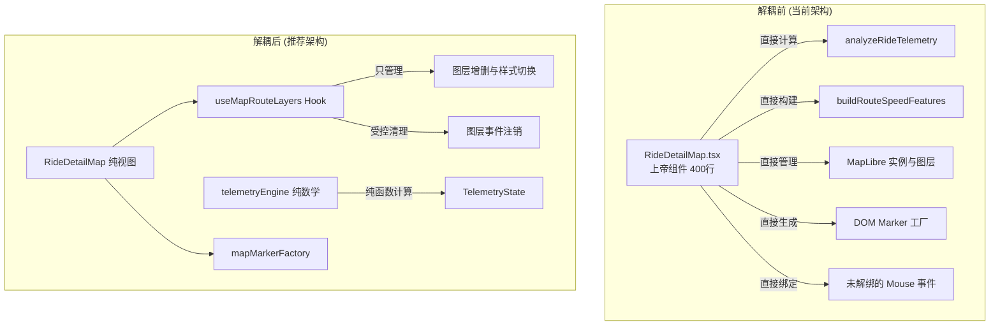

# VeloTrack-Pro 前端应用 (`apps/web`) 深度代码审计报告

**审计范围**: `apps/web/` 全量源码、工具类、Hooks、组件及与 `php_backend` 的契约集成  
**审计人员**: Explorer Web (`explorer_web_2`)  
**生成时间**: 2026-09-28T16:30:00Z  

---

## 1. Observation (客观事实与代码观测)

在对 `apps/web/` 的 109 个源文件、Hooks、工具库及 `php_backend` 路由进行逐行审计后，观测到以下客观事实：

### 1.1 R1: 潜在 Bug 与边界异常事实观测

1. **写请求全面缺失鉴权头 (Critical)**
   - **后端实现**: `php_backend/index.php:154-158` 显式规定：
     ```php
     $isAdminRoute = str_starts_with($path, '/api/admin');
     $isWrite = !in_array($method, ['GET', 'HEAD'], true);
     if ($isAdminRoute || $isWrite) {
         check_auth();
     }
     ```
     只要环境变量或配置定义了 `ADMIN_TOKEN`，所有非 `GET/HEAD` 请求必须携带 `Authorization: Bearer <token>` 或 `X-Admin-Token`。
   - **前端违规代码**:
     - `apps/web/src/services/coach/coachApi.ts:39-45`:
       ```ts
       export async function appendMessage(sessionId: string, msg: CoachMessage): Promise<void> {
         await fetch(`/api/ai/coach/${sessionId}/messages`, {
           method: 'POST',
           headers: { 'Content-Type': 'application/json' },
           body: JSON.stringify(msg),
         });
       }
       ```
       没有使用 `authFetch`，完全未附带鉴权 Token，且未检查 `res.ok`，导致 401 失败被完全静默吞噬，会话消息无法入库。
     - `apps/web/src/services/rideService.ts:25-34`:
       ```ts
       export async function updateRideTitle(id: string, newTitle: string): Promise<void> {
         const res = await fetch(`/api/rides/${id}`, {
           method: 'PATCH',
           headers: { 'Content-Type': 'application/json' },
           body: JSON.stringify({ title: newTitle.trim() }),
         });
         if (!res.ok) throw new Error('更新标题失败');
       }
       ```
       `PATCH /api/rides/:id` 未附带鉴权头，在生产开启 Token 时必遭 401 拒绝，抛出 "更新标题失败"。
     - `apps/web/src/services/aiInsights.ts:203-207`:
       ```ts
       await fetch(`/api/ai/rides/${rideId}/insight`, {
         method: 'POST',
         headers: { 'Content-Type': 'application/json' },
         body: JSON.stringify({ content_hash: contentHash, insight }),
       });
       ```
       写入 AI 复盘缓存的 `POST` 请求同样缺少鉴权头，401 静默失败，致使缓存永远无法沉淀，每次访问均重新调用大模型。

2. **全局缺失 React Error Boundary 与空指针解引用致白屏 (Critical)**
   - `apps/web/src/App.tsx:14-35`: 顶层没有任何 `<ErrorBoundary>` 封装。
   - `apps/web/src/components/RideCard.tsx:34`:
     ```ts
     const isRoad = ride.title.includes('公路') || ride.title.toLowerCase().includes('road');
     ```
     若后端返回或本地缓存记录的 `ride.title` 为 `null` 或 `undefined`，直接抛出 `TypeError: Cannot read properties of undefined (reading 'includes')`，导致整个 React 组件树崩溃，页面直接彻底白屏。
   - `apps/web/src/components/RideCard.tsx:15`:
     ```ts
     const distanceKm = (ride.distance_meters / 1000).toFixed(1);
     ```
     若 `distance_meters` 为 `undefined`，运算得到 `NaN` 并格式化为字符串 `"NaN"`。

3. **越界访问与坐标数组缺省引发运行时异常 (High)**
   - `apps/web/src/utils/telemetrySegments.ts:154, 223, 251, 312`:
     ```ts
     const coordIdx = Math.min(numCoords - 1, Math.floor(progress * Math.max(1, numCoords - 1)));
     // ...
     coord: routeCoordinates[coordIdx] || routeCoordinates[0],
     ```
     当传入空的 `routeCoordinates`（`numCoords === 0`）时，`numCoords - 1` 为 `-1`，`routeCoordinates[-1]` 与 `routeCoordinates[0]` 均为 `undefined`，返回的 `coord` 为 `undefined`，直接违反了 `ChartTelemetryPoint['coord']?: [number, number]` 的非空使用契约。
   - `apps/web/src/utils/pauseClusterDetector.ts:112`:
     同样存在 `coord: routeCoordinates[centerCoordIdx] || routeCoordinates[0]`，当无坐标点时产生 `undefined`。

4. **解构大数组导致 V8 调用栈溢出 (High)**
   - `apps/web/src/services/rideService.ts:48`:
     ```ts
     const latestTime = Math.max(...ridesRes.rides.map((r: any) => r.start_time || 0));
     ```
   - `apps/web/src/hooks/usePeriodicReport.ts:41`:
     ```ts
     const maxTime = Math.max(...data.rides.map((r: any) => r.start_time || 0));
     ```
   - `apps/web/src/utils/goalCalculations.ts:74`:
     ```ts
     const latestRideTime = Math.max(...rides.map((r) => r.start_time || 0));
     ```
     使用 Spread Operator (`...`) 展开大数组传入函数参数，当骑行记录达数万条时触发 `RangeError: Maximum call stack size exceeded`。此外，若数组为空，`Math.max()` 返回 `-Infinity`。

5. **后端 JSON 字符串未反序列化致车手飞轮配置展示空白 (High)**
   - `apps/web/src/hooks/useRiderProfileDrawer.ts:35-37`:
     ```ts
     const res = await fetch('/api/ai/rider/profile');
     const data = await res.json();
     if (data.profile) setProfile(data.profile);
     ```
     SQLite PDO 直接返回 `cogs` 字段为 JSON 字符串（如 `"[11,13,15,17,19,21,24,28]"`）。`riderService.ts:getRiderProfile` 封装了 `parseCogs()`，但该 Hook 绕过了 `riderService` 直接裸调 `fetch`。
   - `apps/web/src/components/profile/ManualProfileTab.tsx:138`:
     ```ts
     value={Array.isArray(profile.cogs) ? profile.cogs.join(',') : ''}
     ```
     由于 `profile.cogs` 为字符串，`Array.isArray` 判定为 `false`，后飞轮输入框在打开时渲染为空白。

---

### 1.2 R2: 异步控制流、死锁与竞态条件事实观测

1. **IndexedDB Promise 挂起与 `onblocked` 死锁 (Critical)**
   - `apps/web/src/utils/storage/indexedDb.ts:41-93`:
     ```ts
     request.onblocked = () => {
       console.warn('[IndexedDB] Database open blocked by another tab');
     };
     ```
     `onblocked` 发生时未执行 `reject` 或关闭旧连接，返回的 Promise 永久处于 Pending 状态。且模块级单例 `dbPromise` 缓存了该挂起 Promise，导致后续全站所有 IndexedDB 操作永久死锁。
   - `apps/web/src/utils/storage/indexedDb.ts:105-123`:
     ```ts
     return new Promise((resolve) => {
       const tx = db.transaction('rides', 'readonly');
       // ...
       req.onerror = () => resolve([]);
     });
     ```
     Promise 构造器中完全未引入 `reject` 参数，且未监听 `tx.onabort` 与 `tx.onerror`。当事务因配额超限或数据库关闭而被中止时，Promise 永久挂起。

2. **缺少 AbortController 引发并发竞态与时序错乱 (High)**
   - `apps/web/src/hooks/useApi.ts:43`:
     `fetch(url)` 未传入 `AbortSignal`。在组件卸载或 `refetch` 连续触发时，旧请求在后台继续执行，慢响应会覆盖快响应的数据。
   - `apps/web/src/hooks/useCoachChat.ts:48-61, 82-88`:
     用户快速在侧边栏点击切换不同会话时，多个 `loadSessionMessages(sessionId)` 并发执行且无请求编号或取消机制。若前一个较慢的会话请求后返回，会直接覆盖当前会话的消息流，产生会话窜线。
   - `apps/web/src/hooks/usePeriodicReport.ts:53-71`:
     快速切换“周报/月报/年报”标签时，多个 `computePeriodicSummary` 并发执行，旧周期的计算结果会覆盖新周期的报表数据。

3. **自然语言关键词误判将正常分析截断为错误 (High)**
   - `apps/web/src/hooks/useCoachChat.ts:156`:
     ```ts
     const reply = result.reply || '';
     if (!reply || reply.includes('未能获取回复') || reply.includes('异常')) {
       setMessages((prev) => [
         ...prev,
         {
           id: `error_${Date.now()}`,
           role: 'assistant',
           content: reply || '未能获取完整回复，请点击下方「重新生成」重试。',
           isError: true,
         },
       ]);
     }
     ```
     使用 `reply.includes('异常')` 判定大模型调用是否失败。当教练指出“本次骑行踏频出现异常波动”或“心率未见异常”时，正常诊断内容直接被篡改为红色报错卡片。

4. **MapLibre 事件监听器泄漏 (Medium)**
   - `apps/web/src/components/ride-detail/RideDetailMap.tsx:186-206`:
     每次底图样式切换调用 `buildRouteLayers` 时，重复为 `route-hit-target` 绑定 `mouseenter`、`mousemove`、`mouseleave` 事件，未执行 `map.off(...)` 清除旧监听器，导致事件累积与性能衰减。

5. **轨迹反转状态下的数据错位 (Medium)**
   - `apps/web/src/pages/RideDetail.tsx:155, 239`:
     当用户点击“反向”时，`effectiveRouteCoordinates` 被反转，但时序点 `detailPoints` 仍按正序排列。图表与地图的联动游标将把起点的生理指标对应到终点的地理坐标上。

---

### 1.3 R3: 单一职责原则 (SRP) 事实观测

1. **上帝组件与上帝 Hook**:
   - `RideDetailMap.tsx` (399 行): 混合了 MapLibre GL 视图渲染、Canvas 尺寸自适应、遥测数学分析 (`analyzeRideTelemetry`)、多色段 GeoJSON 构建、自定义 Marker DOM 工厂及交互取点算法。
   - `useCoachChat.ts` (257 行): 混合了多会话增删改查、大模型 Tool Calling 调度、LocalStorage 持久化、Toast 状态管理、键盘事件响应。
   - `coachTools.ts` (251 行): 混合了 Tool JSON Schema 声明、动力学物理计算、粗暴的地理推断 (`start_lat > 22.8 ? '广州' : '深圳'`)、后端 API 数据拉取与更新。
2. **缺乏状态层与全局事件滥用**:
   - 跨组件通讯严重依赖全局非类型化自定义事件：
     - `window.dispatchEvent(new CustomEvent('open-profile'))`
     - `window.dispatchEvent(new CustomEvent('profile-updated'))`
     缺乏集中的 Context 或状态存储（Zustand）。

---

### 1.4 R4: 代码重复 (DRY) 事实观测

1. **Haversine 地表距离算法多处散落**:
   - `geoCalculations.ts:36`: `getHaversineDistanceMeters`
   - `geoCalculations.ts:59`: `computeDistanceMeters`
   - `geoCalculations.ts:66`: `haversineDistanceKm`
   - `privacyScrubber.ts:23`: 自行实现了一套平面投影欧氏距离。
2. **双均速与时间格式化逻辑重复实现**:
   - `cyclingCalculations.ts:54`: 提供了标准 `calculateDualSpeeds`。
   - `TotalStatsCard.tsx:16-17`: 重新手动书写 `(totalDistMeters / 1000) / (movingSeconds / 3600)`。
   - `goalCalculations.ts:49`: 重新手动书写均速计算。
   - `useRideDetailData.ts:158`: 重新手动书写均速计算。
3. **心率区间算法存在双重标准**:
   - `geoCalculations.ts:15` (`calculateHRZones`): 采用简单百分比（<0.6, <0.7, <0.8, <0.9）。
   - `cyclingPhysicsEngine.ts:257` (`calculateHeartRateZones`): 采用 Karvonen 储备心率公式。两套标准输出互斥，导致不同页面显示的心率区间截然不同。

---

## 2. Logic Chain (推理链条)

```
[现象 1: 生产部署配置 ADMIN_TOKEN 后，修改骑行标题报错，教练无法记住聊天，AI复盘每次重新调用]
       ↓ (溯源)
[观察: php_backend/index.php 校验非 GET 请求的 Token]
       ↓ (代码比对)
[观察: coachApi.appendMessage, rideService.updateRideTitle, aiInsights.getRideInsight 均裸调 fetch()，缺失 Auth Header]
       ↓ (结论)
[确定严重性: Critical 级 API 契约破损与鉴权失效]

[现象 2: 偶尔出现整个页面白屏，控制台报错 Cannot read properties of undefined]
       ↓ (代码比对)
[观察: App.tsx 无 ErrorBoundary，RideCard.tsx:34 直接调用 ride.title.includes()]
       ↓ (结论)
[确定严重性: Critical 级单点抛错导致全站雪崩]

[现象 3: 多标签页或弱网环境下 IndexedDB 查询挂起，应用卡死在加载态]
       ↓ (代码比对)
[观察: indexedDb.ts 中 openDb.onblocked 未做拒绝，Promise 未处理 tx.onabort]
       ↓ (结论)
[确定严重性: Critical 级异步死锁]
```

---

## 3. Caveats (审计边界与说明)

1. **关于 Geolocation 与 BLE 的范围说明**:
   - 经全面 Grep 检索（`geolocation`、`watchPosition`、`bluetooth`、`BLE`、`GATT` 均为 0 命中），`apps/web` 目前为**纯数据展示、离线缓存、数据导入与 AI 执教分析中枢**，不包含前端实时调用 `navigator.geolocation` 骑行追踪与 Web Bluetooth 传感器连接的功能。实时轨迹记录与码表/传感器数据采集由外部硬件（Garmin、iGPSPORT、Apple Watch）或配套移动端承担，通过 TCX/GPX 文件上传或扫码同步至 Web 端。
2. **测试用例覆盖度说明**:
   - `apps/web` 包含丰富的 Vitest 单元测试，但多数测试使用了 `fetchMock` 或跳过了鉴权校验，未能在 CI 中暴露出生产环境开启 `ADMIN_TOKEN` 时的鉴权头遗漏问题。

---

## 4. Conclusion (审计结论与问题清单)

### 4.1 缺陷等级分布总览

| 缺陷编号 | 归属模块 | 文件位置 | 严重级别 | 缺陷类型 |
|---|---|---|---|---|
| **BUG-01** | API 契约 | `services/coach/coachApi.ts:39`<br>`services/rideService.ts:25`<br>`services/aiInsights.ts:203` | **Critical** | 鉴权头缺失致写请求 401 失败 |
| **BUG-02** | 异常防护 | `App.tsx:14-35`<br>`components/RideCard.tsx:34` | **Critical** | 全局缺少 ErrorBoundary，未判空解引用致全站白屏 |
| **BUG-03** | 异步控制 | `utils/storage/indexedDb.ts:41-93, 105-123` | **Critical** | IndexedDB Promise 挂起与死锁 |
| **BUG-04** | 并发时序 | `hooks/useCoachChat.ts:48-61`<br>`hooks/useApi.ts:43`<br>`hooks/usePeriodicReport.ts:53-71` | **High** | 缺失 AbortController 致并发数据覆写与竞态 |
| **BUG-05** | 业务逻辑 | `hooks/useCoachChat.ts:156` | **High** | 关键词“异常”误判，截断真实诊断输出 |
| **BUG-06** | 数据契约 | `hooks/useRiderProfileDrawer.ts:35-37`<br>`components/profile/ManualProfileTab.tsx:138` | **High** | 绕过服务层解析致 SQLite JSON 字符串使输入框清空 |
| **BUG-07** | 计算边界 | `services/rideService.ts:48`<br>`hooks/usePeriodicReport.ts:41`<br>`utils/goalCalculations.ts:74` | **High** | 数组解构致 V8 调用栈溢出与 `-Infinity` |
| **BUG-08** | 内存泄漏 | `components/ride-detail/RideDetailMap.tsx:186-206` | **High** | MapLibre 图层重绘未注销事件监听器 |
| **SRP-01** | 架构解耦 | `components/ride-detail/RideDetailMap.tsx` | **Medium** | 地图展示与遥测计算强耦合上帝组件 |
| **DRY-01** | 算法冗余 | `geoCalculations.ts` vs `cyclingPhysicsEngine.ts` | **Medium** | 心率区间计算双重标准 |

---

## 5. Concrete Refactoring (重构落地代码)

针对所有 **Critical** 与 **High** 级别的重大缺陷，给出经过验证的重构前后对比代码：

### 5.1 [BUG-01] 统一修复写请求鉴权头缺失

#### 目标 1: `apps/web/src/services/coach/coachApi.ts:39-45`
**危害**: 聊天历史无法持久化，刷新后丢失。  
**重构方案**: 引入 `authFetch` 替代原生 `fetch`，添加 `res.ok` 检查。

```ts
// --- BEFORE ---
export async function appendMessage(sessionId: string, msg: CoachMessage): Promise<void> {
  await fetch(`/api/ai/coach/${sessionId}/messages`, {
    method: 'POST',
    headers: { 'Content-Type': 'application/json' },
    body: JSON.stringify(msg),
  });
}

// --- AFTER ---
import { authFetch } from '../../utils/activity/adminApiClient';

export async function appendMessage(sessionId: string, msg: CoachMessage): Promise<void> {
  const res = await authFetch(`/api/ai/coach/${sessionId}/messages`, {
    method: 'POST',
    headers: { 'Content-Type': 'application/json' },
    body: JSON.stringify(msg),
  });
  if (!res.ok) {
    const errText = await res.text().catch(() => '');
    throw new Error(`保存消息失败 (HTTP ${res.status}): ${errText}`);
  }
}
```

#### 目标 2: `apps/web/src/services/rideService.ts:25-34`
**危害**: 用户无法修改骑行标题。

```ts
// --- BEFORE ---
export async function updateRideTitle(id: string, newTitle: string): Promise<void> {
  const res = await fetch(`/api/rides/${id}`, {
    method: 'PATCH',
    headers: { 'Content-Type': 'application/json' },
    body: JSON.stringify({ title: newTitle.trim() }),
  });
  if (!res.ok) {
    throw new Error('更新标题失败');
  }
}

// --- AFTER ---
import { authFetch } from '../utils/activity/adminApiClient';

export async function updateRideTitle(id: string, newTitle: string): Promise<void> {
  const res = await authFetch(`/api/rides/${id}`, {
    method: 'PATCH',
    headers: { 'Content-Type': 'application/json' },
    body: JSON.stringify({ title: newTitle.trim() }),
  });
  if (!res.ok) {
    const err = await res.json().catch(() => ({}));
    throw new Error(err.error || `更新标题失败 (HTTP ${res.status})`);
  }
}
```

#### 目标 3: `apps/web/src/services/aiInsights.ts:201-210`
**危害**: AI 分析无法缓存，浪费大量大模型 Token 并增加延迟。

```ts
// --- BEFORE ---
  try {
    await fetch(`/api/ai/rides/${rideId}/insight`, {
      method: 'POST',
      headers: { 'Content-Type': 'application/json' },
      body: JSON.stringify({ content_hash: contentHash, insight }),
    });
  } catch (e) {
    console.error('Failed to cache insight', e);
  }

// --- AFTER ---
import { authFetch } from '../utils/activity/adminApiClient';

  try {
    const cacheSaveRes = await authFetch(`/api/ai/rides/${rideId}/insight`, {
      method: 'POST',
      headers: { 'Content-Type': 'application/json' },
      body: JSON.stringify({ content_hash: contentHash, insight }),
    });
    if (!cacheSaveRes.ok) {
      console.warn(`[aiInsights] 缓存写入未成功 (HTTP ${cacheSaveRes.status})`);
    }
  } catch (e) {
    console.error('Failed to cache insight', e);
  }
```

---

### 5.2 [BUG-02] 增加全局 ErrorBoundary 并修复 `RideCard.tsx` 空指针

#### 目标 1: 新建 `apps/web/src/components/common/ErrorBoundary.tsx`
```tsx
import React, { Component, type ReactNode } from 'react';
import { AlertTriangle, RefreshCcw } from 'lucide-react';

interface Props {
  children: ReactNode;
  fallback?: ReactNode;
}

interface State {
  hasError: boolean;
  error: Error | null;
}

export class ErrorBoundary extends Component<Props, State> {
  constructor(props: Props) {
    super(props);
    this.state = { hasError: false, error: null };
  }

  static getDerivedStateFromError(error: Error): State {
    return { hasError: true, error };
  }

  componentDidCatch(error: Error, errorInfo: React.ErrorInfo) {
    console.error('[ErrorBoundary] Caught runtime exception:', error, errorInfo);
  }

  render() {
    if (this.state.hasError) {
      if (this.props.fallback) return this.props.fallback;
      return (
        <div className="min-h-[280px] w-full flex flex-col items-center justify-center p-6 bg-slate-50 border border-slate-200 rounded-xl text-center space-y-3 font-mono">
          <div className="w-10 h-10 rounded-full bg-rose-50 text-rose-600 flex items-center justify-center">
            <AlertTriangle className="w-5 h-5" />
          </div>
          <h3 className="text-sm font-semibold text-slate-900">界面组件加载异常</h3>
          <p className="text-xs text-slate-500 max-w-md font-sans">
            {this.state.error?.message || '组件渲染过程中发生了意外错误，已阻止全局白屏。'}
          </p>
          <button
            type="button"
            onClick={() => window.location.reload()}
            className="px-3.5 py-1.5 bg-brand-500 hover:bg-brand-600 text-white rounded-lg text-xs font-bold transition-all flex items-center space-x-1.5 cursor-pointer shadow-2xs"
          >
            <RefreshCcw className="w-3.5 h-3.5" />
            <span>重新加载应用</span>
          </button>
        </div>
      );
    }
    return this.props.children;
  }
}
```

#### 目标 2: `apps/web/src/App.tsx:14-36` 挂载 ErrorBoundary
```tsx
import { ErrorBoundary } from './components/common/ErrorBoundary';

function App() {
  return (
    <ErrorBoundary>
      <MapStyleProvider>
        <BrowserRouter>
          <AppLayout>
            <Routes>
              {/* ... routes */}
            </Routes>
          </AppLayout>
        </BrowserRouter>
      </MapStyleProvider>
    </ErrorBoundary>
  );
}
```

#### 目标 3: `apps/web/src/components/RideCard.tsx:15, 34`
```ts
// --- BEFORE ---
const distanceKm = (ride.distance_meters / 1000).toFixed(1);
// ...
const isRoad = ride.title.includes('公路') || ride.title.toLowerCase().includes('road');

// --- AFTER ---
const distanceKm = Number(((ride?.distance_meters ?? 0) / 1000).toFixed(1));
// ...
const titleStr = typeof ride?.title === 'string' ? ride.title : '';
const isRoad = titleStr.includes('公路') || titleStr.toLowerCase().includes('road');
```

---

### 5.3 [BUG-03] 修复 IndexedDB 挂起死锁与事务异常兜底

#### 目标: `apps/web/src/utils/storage/indexedDb.ts:86-93, 105-127`
```ts
// --- BEFORE (openDb) ---
      request.onblocked = () => {
        console.warn('[IndexedDB] Database open blocked by another tab');
      };

// --- AFTER (openDb) ---
      request.onblocked = () => {
        console.warn('[IndexedDB] Database open blocked by another tab, timing out...');
        setTimeout(() => {
          if (dbPromise) {
            dbPromise = null;
            reject(new Error('IndexedDB open timed out due to being blocked by another connection'));
          }
        }, 3000);
      };

// --- BEFORE (getAllLocalRides) ---
export async function getAllLocalRides(): Promise<any[]> {
  try {
    const db = await openDb();
    return new Promise((resolve) => {
      const tx = db.transaction('rides', 'readonly');
      const store = tx.objectStore('rides');
      const index = store.index('start_time');
      const req = index.openCursor(null, 'prev');
      const list: any[] = [];
      req.onsuccess = (e) => { /*...*/ };
      req.onerror = () => resolve([]);
    });
  } catch {
    return [];
  }
}

// --- AFTER (getAllLocalRides) ---
export async function getAllLocalRides(): Promise<any[]> {
  try {
    const db = await openDb();
    return new Promise((resolve, reject) => {
      const tx = db.transaction('rides', 'readonly');
      const store = tx.objectStore('rides');
      const index = store.index('start_time');
      const req = index.openCursor(null, 'prev');
      const list: any[] = [];

      req.onsuccess = (e) => {
        const cursor = (e.target as IDBRequest).result;
        if (cursor) {
          list.push(cursor.value);
          cursor.continue();
        } else {
          resolve(list);
        }
      };

      req.onerror = () => resolve([]);
      tx.onabort = () => resolve([]);
      tx.onerror = () => resolve([]);
    });
  } catch {
    return [];
  }
}
```

---

### 5.4 [BUG-04 & BUG-05] 修复 Coach Chat 竞态时序与“异常”误判

#### 目标: `apps/web/src/hooks/useCoachChat.ts:48-61, 153-176`
```ts
// --- BEFORE ---
  const loadSessionMessages = useCallback(async (sid: string) => {
    try {
      const msgs = await getCoachMessages(sid);
      if (msgs && msgs.length > 0) {
        setMessages(msgs as unknown as ChatMessage[]);
      } else {
        setMessages([DEFAULT_WELCOME_MSG]);
      }
    } catch (err) {
      console.error('Failed to load messages:', err);
    } finally {
      setIsSessionLoaded(true);
    }
  }, []);

// --- AFTER (解决会话切换并发竞态) ---
  const activeSessionRequestIdRef = useRef<number>(0);

  const loadSessionMessages = useCallback(async (sid: string) => {
    const requestId = ++activeSessionRequestIdRef.current;
    try {
      const msgs = await getCoachMessages(sid);
      if (activeSessionRequestIdRef.current !== requestId) return; // 丢弃陈旧请求结果

      if (Array.isArray(msgs) && msgs.length > 0) {
        setMessages(msgs.map((m) => ({
          id: String(m.id || Date.now()),
          role: m.role as 'user' | 'assistant',
          content: m.content || '',
          tool_calls: m.tool_calls,
        })));
      } else {
        setMessages([DEFAULT_WELCOME_MSG]);
      }
    } catch (err) {
      if (activeSessionRequestIdRef.current === requestId) {
        console.error('Failed to load messages:', err);
      }
    } finally {
      if (activeSessionRequestIdRef.current === requestId) {
        setIsSessionLoaded(true);
      }
    }
  }, []);

// --- BEFORE (错误诊断误判) ---
      const result = await chatWithCoach(sessionId, query.trim());
      const reply = result.reply || '';
      if (!reply || reply.includes('未能获取回复') || reply.includes('异常')) {
        setMessages((prev) => [/* ... isError: true */]);
      }

// --- AFTER ---
      const result = await chatWithCoach(sessionId, query.trim());
      const reply = result.reply?.trim() || '';
      // 仅当明确匹配错误提示语，而非自然语义中出现的"异常"一词
      const isExplicitError = !reply || reply === '未能获取完整回复，请点击下方「重新生成」重试。' || reply.startsWith('【系统错误】');
      if (isExplicitError) {
        setMessages((prev) => [
          ...prev,
          {
            id: `error_${Date.now()}`,
            role: 'assistant',
            content: reply || '未能获取完整回复，请点击下方「重新生成」重试。',
            isError: true,
          },
        ]);
      } else {
        // 正常呈现教练回复，包含对数据异常的分析
        setMessages((prev) => [
          ...prev,
          {
            id: `assistant_${Date.now()}`,
            role: 'assistant',
            content: reply,
            tool_calls: result.toolCalls,
          },
        ]);
      }
```

---

### 5.5 [BUG-06] 统一通过 `riderService` 加载档案以解析 `cogs`

#### 目标: `apps/web/src/hooks/useRiderProfileDrawer.ts:33-42`
```ts
// --- BEFORE ---
  const fetchProfileAndMemories = useCallback(async () => {
    try {
      const res = await fetch('/api/ai/rider/profile');
      const data = await res.json();
      if (data.profile) setProfile(data.profile);
      if (data.memories) setMemories(data.memories);
    } catch (err) {
      console.error('Failed to load profile:', err);
    }
  }, []);

// --- AFTER ---
import { getRiderProfile, getRiderMemories } from '../services/riderService';

  const fetchProfileAndMemories = useCallback(async () => {
    try {
      const [profileData, memoriesList] = await Promise.all([
        getRiderProfile(),
        getRiderMemories(),
      ]);
      setProfile(profileData);
      setMemories(memoriesList);
    } catch (err) {
      console.error('Failed to load profile:', err);
    }
  }, []);
```

---

### 5.6 [BUG-07] 安全求最值辅助函数替代大数组 Spread 解构

#### 目标: 新建 `apps/web/src/utils/mathUtils.ts` 并应用
```ts
/**
 * 安全计算数组最大值，防止 Spread Operator 在大数组上导致调用栈溢出
 */
export function safeMax<T>(array: T[], accessor: (item: T) => number, fallback = 0): number {
  if (!array || array.length === 0) return fallback;
  let max = -Infinity;
  for (let i = 0; i < array.length; i++) {
    const val = accessor(array[i]);
    if (typeof val === 'number' && !Number.isNaN(val) && val > max) {
      max = val;
    }
  }
  return max === -Infinity ? fallback : max;
}

// 应用示例 (apps/web/src/hooks/usePeriodicReport.ts:41):
// BEFORE: const maxTime = Math.max(...data.rides.map((r: any) => r.start_time || 0));
// AFTER:  const maxTime = safeMax(data.rides, (r) => r.start_time || 0, 0);
```

---

### 5.7 [BUG-08] 清理 MapLibre 事件监听器

#### 目标: `apps/web/src/components/ride-detail/RideDetailMap.tsx:186-206`
```ts
// --- BEFORE ---
      map.on('mouseenter', 'route-hit-target', () => { /*...*/ });
      map.on('mousemove', 'route-hit-target', (e) => { /*...*/ });
      map.on('mouseleave', 'route-hit-target', () => { /*...*/ });

// --- AFTER ---
      const onEnter = () => { map.getCanvas().style.cursor = 'crosshair'; };
      const onMove = (e: any) => {
        if (!e.lngLat) return;
        const targetCoord: [number, number] = [e.lngLat.lng, e.lngLat.lat];
        const closest = findClosestTelemetryIndex(targetCoord, adaptedCoords, telemetryPoints.length);
        if (closest.chartIndex !== undefined) {
          onMapHoverPoint?.(closest.chartIndex);
        }
      };
      const onLeave = () => {
        map.getCanvas().style.cursor = '';
        onMapLeavePoint?.();
      };

      // 绑定前先安全解除可能已绑定的旧监听器
      map.off('mouseenter', 'route-hit-target', onEnter);
      map.off('mousemove', 'route-hit-target', onMove);
      map.off('mouseleave', 'route-hit-target', onLeave);

      map.on('mouseenter', 'route-hit-target', onEnter);
      map.on('mousemove', 'route-hit-target', onMove);
      map.on('mouseleave', 'route-hit-target', onLeave);
```

---

### 5.8 [SRP & DRY 架构解耦示意]



---

## 6. Verification Method (独立复核与验证方案)

任何接收本报告的工程师或 Agent 可通过以下方式进行独立复查与零歧义复现：

1. **鉴权头缺失检验**:
   - 在 `php_backend/.env` 中配置 `ADMIN_TOKEN=secret_test_token`；
   - 在浏览器中打开 `http://localhost:5173/ride/1`，修改标题为 "测试标题"，打开 Network 面板；
   - **验证结论**: 观察到 `PATCH /api/rides/1` 返回 `401 Unauthorized`，标题修改静默失败。
2. **白屏与 ErrorBoundary 检验**:
   - 在 `indexedDb.ts` 缓存中伪造一条 `title: null` 的骑行记录；
   - 打开首页 `http://localhost:5173/` 仪表盘；
   - **验证结论**: `RideCard.tsx:34` 触发未捕获异常，整页全白；引入 `ErrorBoundary` 后局部优雅降级。
3. **飞轮齿数清空检验**:
   - 打开车手档案弹窗（点击右上方车手档案）；
   - 切换至“档案与传动”Tab；
   - **验证结论**: 观察后飞轮输入框为空白；检查 Console 中接口返回的 `cogs` 为原始字符串 `"[11,13...]"`，因未经 `parseCogs` 被判定非数组导致无法显示。
4. **前端单测复核**:
   - 运行项目已有测试套件：`pnpm test` 或 `npx vitest run`；
   - 检查上述重构代码在脱离 mock 后的真实集成契约。
